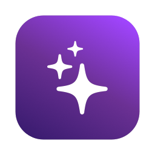

<div align="center">



# MashClean

**Dọn dẹp Mac an toàn, minh bạch, nhanh.**

Biết rõ từng byte sắp xoá là gì, thuộc app nào, và vì sao an toàn.


[English](README.en.md) · **Tiếng Việt**

[**⬇️ Tải về**](https://github.com/MashiXx/MashClean/releases/latest)

</div>

---

## Tải về

**[⬇️ Tải MashClean cho macOS](https://github.com/MashiXx/MashClean/releases/latest)** · bản DMG universal, chạy trên Apple Silicon và Intel, yêu cầu macOS 13 trở lên.

> Bản hiện tại chưa được ký bằng Developer ID và chưa notarize, nên lần đầu mở macOS sẽ chặn. Cách mở: kéo app vào Applications, mở thử một lần, rồi vào **System Settings → Privacy & Security** và bấm **Open Anyway** (trên macOS 14 trở về trước có thể chuột phải vào app → **Open**). Helper quyền quản trị và menu chuột phải trong Finder có thể chưa hoạt động ở bản này.

## Vì sao là MashClean?

Hầu hết app dọn dẹp chỉ đưa bạn một con số lớn và nút "Dọn ngay". MashClean làm khác:

- 🔍 **Mọi mục đều giải thích được.** Mỗi đề xuất kèm lý do ("npm sẽ tự tải lại khi cần"), app sở hữu và mức an toàn: *An toàn*, *Cần xem lại*, *Rủi ro*. Chỉ mục an toàn mới được chọn sẵn.
- 🗑️ **File của bạn đi qua Thùng rác.** File do bạn tạo (bản tải về, file lớn, file trùng) không bao giờ bị xoá thẳng hay tự chọn. Màn **Lịch sử** có nút **Khôi phục** trong 90 ngày.
- 🛡️ **Có vùng cấm không thể vượt qua.** `/System`, Keychain, iCloud Drive, Ảnh, Tin nhắn và chính các thư mục Documents/Desktop luôn bị chặn, ngay cả khi một rule chỉ tới. Mọi đường dẫn được kiểm tra lại ngay trước khi xoá, chống cả tấn công bằng symlink.
- ⚡ **Nhanh.** Quét rác cả máy khoảng 290 nghìn file trong ~6 giây trên SSD, nhờ đọc thư mục hàng loạt bằng `getattrlistbulk` và đo song song.
- 👩‍💻 **Hiểu dân lập trình.** Rác Xcode (DerivedData, simulator hỏng, runtime không dùng), cache npm/yarn/pnpm, Homebrew, pip, Gradle, Maven, CocoaPods, JetBrains, VS Code, Docker…
- 🌐 **Tiếng Việt và tiếng Anh.** Đổi ngôn ngữ ngay ở sidebar, trong Cài đặt hoặc từ thanh menu.

## Tính năng

| | Tính năng | Làm gì |
|---|---|---|
| ✨ | **Smart Scan** | Một nút quét cả máy, gom kết quả thành 3 thẻ *Dọn dẹp*, *Bảo trì*, *Ứng dụng*. Bấm **Chạy** để làm mọi mục an toàn cùng lúc. |
| 🧹 | **Rác hệ thống** | Cache, log, báo cáo crash, rác Xcode, cache công cụ lập trình, bản sao lưu iOS, bản cài iOS cũ, Thùng rác (cả ổ ngoài), bản tải về cũ, tệp đính kèm Mail. |
| 📦 | **Gỡ cài đặt** | Gỡ app kèm file sót, xếp theo độ tin cậy: theo bundle ID, Team ID, tên app, LaunchAgent, package receipt. Tìm cả file sót của app bạn đã kéo vào Thùng rác từ lâu. |
| 🌀 | **Space Lens** | Bản đồ dung lượng dạng biểu đồ tròn nhiều tầng: bấm để đi sâu vào thư mục, tự cập nhật khi file thay đổi. |
| 🔧 | **Bảo trì** | Xoá cache DNS, đánh lại chỉ mục Spotlight, giải phóng RAM, chạy script định kỳ, thu gọn snapshot Time Machine, dựng lại Launch Services, tối ưu Mail. Có gợi ý tác vụ nào nên chạy dựa trên tình trạng máy. |
| ⏻ | **Login Items** | Xem, tắt, xoá LaunchAgent/Daemon; đánh dấu mục **hỏng** khi chương trình của nó không còn tồn tại. |
| 🐘 | **File lớn & cũ** | Tìm qua Spotlight, lọc theo loại file, dung lượng, lần dùng cuối. |
| 👯 | **File trùng lặp** | So 3 bước (dung lượng → xxHash3 đầu/cuối file → SHA-256 toàn bộ), bỏ qua bản clone APFS vì xoá chúng không giải phóng gì, gợi ý bản nên giữ. |
| 📊 | **Thanh menu** | CPU, RAM, tốc độ mạng, dung lượng trống, pin, có biểu đồ nhỏ. Tự chọn chỉ số nào hiện trên thanh menu. Cảnh báo khi ổ sắp đầy hoặc Thùng rác quá lớn. |
| 🖱️ | **Finder & Shortcuts** | Chuột phải trong Finder: *Phân tích bằng MashClean*, *Gỡ bằng MashClean*. Shortcuts: *Dọn rác*, *Dung lượng trống*. |

## An toàn là trên hết

Chỉ một lần xoá nhầm là mất niềm tin. Vì vậy MashClean được thiết kế để khó xoá nhầm:

1. **Lập kế hoạch trước, xoá sau.** Bạn thấy chính xác những gì sắp xảy ra. Mục cần quyền quản trị hoặc cần xem lại luôn có hộp xác nhận liệt kê chi tiết.
2. **Helper quyền root bị khoá chặt.** Helper chỉ nhận lệnh có tên cụ thể từ chính MashClean (kiểm tra chữ ký hai chiều), không bao giờ chạy lệnh shell tuỳ ý, và tự kiểm tra lại từng đường dẫn.
3. **Không đụng thứ đang dùng.** Bỏ qua file đang mở và cache của app đang chạy.
4. **Không thinning app.** MashClean không cắt bớt binary vì làm vậy phá chữ ký của app. Gói ngôn ngữ chỉ hiện trong mục *Nâng cao* kèm cảnh báo rõ.
5. **Chế độ thử (dry run).** Chạy toàn bộ luồng mà không xoá gì, để xem trước kết quả.

## Tri thức tách khỏi code

Phần "biết đường dẫn nào xoá được" nằm trong bộ **111 rule JSON**: 61 rule cho các nhóm rác hệ thống và 50 rule cho file sót của 30 ứng dụng phổ biến (JetBrains, Adobe, Microsoft Office, Chrome, Slack, Zoom, Steam, Battle.net, Docker Desktop…). Bộ rule được:

- **ký Ed25519**, nên không ai sửa được để biến app thành công cụ xoá file tuỳ ý;
- **cập nhật từ xa** mà không cần cập nhật app, có chống hạ cấp và công tắc tắt khẩn cấp từng rule;
- **kiểm thử tự động** trên cây thư mục giả lập bằng công cụ `rulepack`.

## Riêng tư

- Không gửi gì đi mặc định. Thống kê ẩn danh chỉ bật khi bạn đồng ý, và chỉ gồm số liệu tổng hợp, không bao giờ có đường dẫn hay tên file.
- Báo cáo lỗi được gom ngay trên máy để bạn xem trước, chỉ gửi khi bạn bấm.
- Không có SDK bên thứ ba theo dõi người dùng.

## Cài đặt

1. Tải `MashClean-<phiên bản>.dmg` ở trang [Releases](https://github.com/MashiXx/MashClean/releases/latest), mở ra, kéo **MashClean** vào **Applications**.
2. Mở app và làm theo hướng dẫn lần đầu:
   - **Ngôn ngữ**: chọn tiếng Việt, tiếng Anh hoặc theo hệ thống.
   - **Full Disk Access**: để quét được cache và dữ liệu của app khác. Có thể bỏ qua; khi đó app chạy ở chế độ hạn chế và ghi rõ nhóm nào cần quyền.
   - **Helper quản trị**: để dọn cache hệ thống và chạy tác vụ bảo trì cần root.
3. Bấm **Quét**.

Yêu cầu macOS 13 Ventura trở lên, chạy native trên cả Apple Silicon và Intel.

---

## Dành cho lập trình viên

MashClean viết bằng Swift 6 (strict concurrency), SwiftUI + AppKit, theo tài liệu thiết kế [docs/SYSTEM_DESIGN.md](docs/SYSTEM_DESIGN.md).

### Build

Cần Xcode 16+ và `brew install xcodegen`.

```bash
Scripts/build-rules.sh        # lint → test → đóng gói → ký → kiểm tra bộ rule
Scripts/build-app.sh          # sinh Xcode project bằng XcodeGen rồi build (Debug)
Scripts/build-app.sh Release  # bản Release universal
open .build/DerivedData/Build/Products/Debug/MashClean.app
```

Chạy test: `cd Packages && swift test`.

### Kiến trúc

```
MashClean.app
├── App chính (quyền người dùng): UI, Scan Engine, Clean Engine
├── Library/LoginItems/MashCleanMenu.app   thanh menu và giám sát
├── Library/HelperTools/com.mashclean.helper   helper root (XPC, SMAppService)
├── PlugIns/MashCleanFinder.appex            menu chuột phải trong Finder
└── Extensions/MashCleanIntents.appex        Shortcuts
```

| Thư mục | Nội dung |
|---|---|
| `Packages/Foundation` | Model chung, `PathPolicy`, log, database (GRDB), XPC, quyền |
| `Packages/Engine` | Duyệt file nhanh, cây kết quả, Scan Engine dạng DAG, Rule Engine, Clean Engine |
| `Packages/Features` | 8 tính năng, mỗi cái chia `Scanning` / `Domain` / `UI` |
| `Packages/UI` | Design system và màn hình dùng chung |
| `Rules/` | Nguồn rule JSON; `Tests/Fixtures/rules` là fixture cho `rulepack test` |
| `Localization/` | `en.json` (bản dịch tiếng Anh, khoá là chuỗi tiếng Việt gốc) và các file `.lproj` sinh tự động |
| `App/`, `MenuBar/`, `Helper/`, `Extensions/` | Các target Xcode (chỉ entry point và cấu hình) |
| `Scripts/` | Build, DMG, notarize, phát hành, công cụ bản địa hoá |

### Bản địa hoá

Chuỗi giao diện viết bằng tiếng Việt trong code và bọc bằng `String(localized:)`. Thêm chuỗi mới thì chạy `Scripts/l10n/update.sh`: trình biên dịch trích khoá vào `Localization/en.json`. Điền bản dịch tiếng Anh còn trống rồi chạy `python3 Scripts/l10n/gen_strings.py` để sinh lại các file `.lproj`.

### Ký và phát hành

Mặc định build ký **ad-hoc** để chạy trên máy dev. Ở chế độ này helper root và Finder extension có thể không hoạt động. Để phân phối, sao chép `Config/Signing.local.xcconfig.example` thành `Config/Signing.local.xcconfig`, điền Team ID và chứng chỉ Developer ID, rồi chạy `Scripts/release.sh` (build → ký → DMG → notarize → appcast Sparkle).

Khoá ký rule nằm ở `Secrets/rules_signing_key.b64` (không commit; trên CI là secret `RULES_SIGNING_KEY`).

### Gỡ lỗi

- Chế độ thử: biến môi trường `MASHCLEAN_DRY_RUN=1` hoặc menu **Debug → Chế độ thử**.
- Bản Debug nạp được rule chưa ký từ thư mục nguồn: `MASHCLEAN_RULES_DIR=/path/to/Rules`.
- Xem log: `log stream --predicate 'subsystem BEGINSWITH "com.mashclean"' --level debug`, file log ở `~/Library/Logs/MashClean/`.
