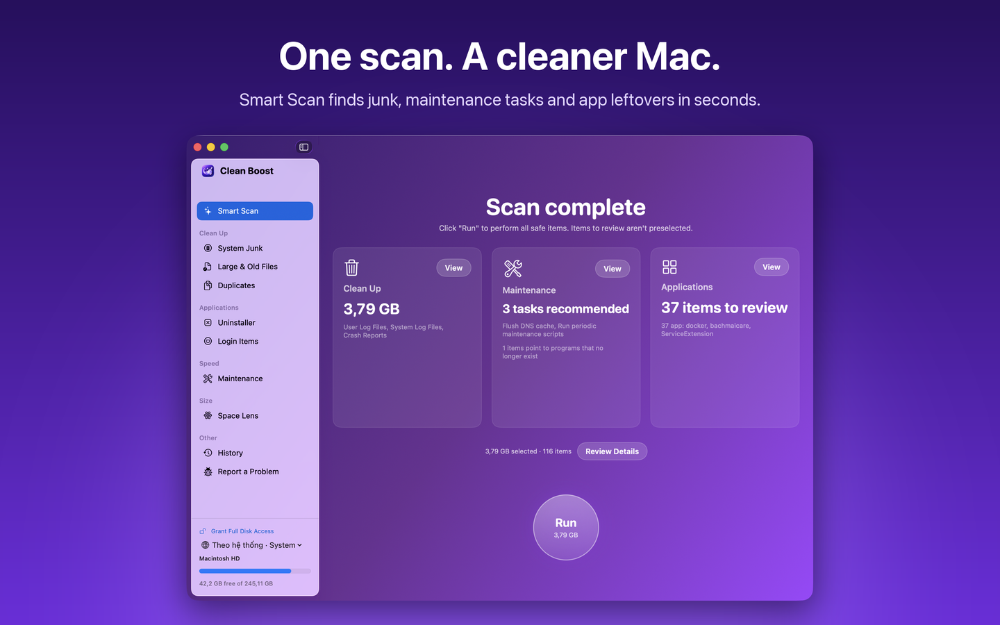

<div align="center">


# Clean Boost

**Clean your Mac safely, transparently, and fast.**

Know exactly what every byte is before it goes: which app it belongs to, and why it's safe to remove.


**English** · [Tiếng Việt](README.vi.md)

[**⬇️ Download**](https://github.com/MashiXx/MashClean/releases/latest)



</div>

---

## Download

**[⬇️ Download Clean Boost for macOS](https://github.com/MashiXx/MashClean/releases/latest)** · universal DMG for Apple Silicon and Intel, requires macOS 13 or later.

> This build is not yet signed with a Developer ID or notarized, so macOS blocks it the first time. To open it: drag the app to Applications, try opening it once, then go to **System Settings → Privacy & Security** and click **Open Anyway** (on macOS 14 and earlier you can also right-click the app → **Open**). The admin helper and the Finder right-click menu may not work in this build.

## Why Clean Boost?

Most cleaners hand you one big number and a "Clean Now" button. Clean Boost does it differently:

- 🔍 **Every item is explained.** Each suggestion comes with a reason ("npm downloads these again when needed"), the app it belongs to, and a safety level: *Safe*, *Review*, or *Risky*. Only safe items are preselected.
- 🗑️ **Your files go to the Trash.** Files you created (downloads, large files, duplicates) are never deleted outright and never preselected. The **History** screen has a **Restore** button for 90 days.
- 🛡️ **Some places are simply off-limits.** `/System`, your Keychain, iCloud Drive, Photos, Messages, and the Documents/Desktop folders themselves are always blocked, even if a rule points at them. Every path is checked again right before deletion, including against symlink tricks.
- ⚡ **Fast.** Scans about 290,000 files of system junk in roughly 6 seconds on an SSD, by reading directories in bulk with `getattrlistbulk` and measuring in parallel.
- 👩‍💻 **Speaks developer.** Xcode junk (DerivedData, broken simulators, unused runtimes), npm/yarn/pnpm, Homebrew, pip, Gradle, Maven, CocoaPods, JetBrains, VS Code, and Docker caches.
- 🌐 **English and Vietnamese.** Switch languages from the sidebar, Settings, or the menu bar.

## Features

| | Feature | What it does |
|---|---|---|
| ✨ | **Smart Scan** | One scan for the whole Mac, summarized as three cards: *Cleanup*, *Maintenance*, *Applications*. Press **Run** to handle every safe item at once. |
| 🧹 | **System Junk** | Caches, logs, crash reports, Xcode junk, developer tool caches, iOS backups, old iOS installers, the Trash (external drives too), old downloads, Mail attachments. |
| 📦 | **Uninstaller** | Removes apps along with their leftovers, ranked by confidence: bundle ID, Team ID, app name, LaunchAgents, package receipts. Also finds leftovers from apps you dragged to the Trash long ago. |
| 🌀 | **Space Lens** | A sunburst map of your disk: click to drill into folders. It updates itself as files change. |
| 🔧 | **Maintenance** | Flush DNS, reindex Spotlight, free up RAM, run periodic scripts, thin Time Machine local snapshots, rebuild Launch Services, speed up Mail. Suggests which tasks are worth running based on your Mac's current state. |
| ⏻ | **Login Items** | View, disable, and remove LaunchAgents and LaunchDaemons. Flags items as **broken** when their program no longer exists. |
| 🐘 | **Large & Old Files** | Finds them through Spotlight; filter by type, size, and last use. |
| 👯 | **Duplicates** | Compares in three steps (size → xxHash3 of the start and end of each file → full SHA-256). Skips APFS clones, since deleting them frees nothing, and suggests which copy to keep. |
| 📊 | **Menu bar** | CPU, RAM, network speed, free space, and battery, with small history charts. Choose which numbers show in the menu bar. Alerts you when the disk is almost full or the Trash gets too big. |
| 🖱️ | **Finder & Shortcuts** | Right-click in Finder: *Analyze with Clean Boost*, *Uninstall with Clean Boost*. Shortcuts actions: *Clean Junk*, *Free Space*. |

## Safety first

One wrong deletion is enough to lose a user's trust. So Clean Boost is built to make wrong deletions hard:

1. **Plan first, delete second.** You see exactly what will happen. Anything that needs administrator rights or a second look always gets a confirmation dialog that lists the details.
2. **A locked-down admin helper.** The privileged helper only accepts named commands from Clean Boost itself (code signatures are checked in both directions), never runs arbitrary shell commands, and re-checks every path on its own.
3. **Hands off what's in use.** Open files and caches of running apps are skipped.
4. **No app thinning.** Clean Boost doesn't strip binaries, because that breaks an app's code signature. Language files only appear under *Advanced* with a clear warning.
5. **Dry run mode.** Run the whole flow without deleting anything, to preview the result.

## Knowledge lives outside the code

Knowing which paths are safe to delete lives in a set of **111 JSON rules**: 61 for system junk categories and 50 for the leftovers of 30 popular apps (JetBrains, Adobe, Microsoft Office, Chrome, Slack, Zoom, Steam, Battle.net, Docker Desktop…). The rule set is:

- **signed with Ed25519**, so nobody can tamper with it to turn the app into a tool that deletes arbitrary files;
- **updated remotely** without an app update, with downgrade protection and a kill switch for individual rules;
- **tested automatically** against mock directory trees with the `rulepack` tool.

## Privacy

- Nothing is sent by default. Anonymous statistics are only enabled if you opt in, and contain only aggregate numbers, never paths or file names.
- Problem reports are assembled on your Mac for you to review, and only sent when you click.
- No third-party tracking SDKs.

## Installation

1. Download `CleanBoost-<version>.dmg` from the [Releases](https://github.com/MashiXx/MashClean/releases/latest) page, open it, and drag **Clean Boost** to **Applications**.
2. Open the app and follow the first-run guide:
   - **Language**: pick English, Vietnamese, or follow the system.
   - **Full Disk Access**: lets Clean Boost scan caches and other apps' data. You can skip it; the app then runs in limited mode and labels the categories that need it.
   - **Admin helper**: needed to clean system caches and run maintenance tasks that require root.
3. Click **Scan**.

Requires macOS 13 Ventura or later. Runs natively on both Apple Silicon and Intel.

---

## For developers

Clean Boost is written in Swift 6 (strict concurrency) with SwiftUI and AppKit, following the design document [docs/SYSTEM_DESIGN.md](docs/SYSTEM_DESIGN.md) (in Vietnamese).

### Build

Requires Xcode 16+ and `brew install xcodegen`.

```bash
Scripts/build-rules.sh        # lint → test → package → sign → verify the rule set
Scripts/build-app.sh          # generate the Xcode project with XcodeGen, then build (Debug)
Scripts/build-app.sh Release  # universal Release build
open ".build/DerivedData/Build/Products/Debug/Clean Boost.app"
```

Run tests: `cd Packages && swift test`.

App icon: `swift Scripts/make-icon.swift` regenerates every size in `AppIcon.appiconset` from `design/logo_design.png`. App Store screenshots live in `design/AppStore/` (`python3 design/AppStore/compose.py` rebuilds them from `raw/`).

### Architecture

```
Clean Boost.app
├── Main app (user privileges): UI, Scan Engine, Clean Engine
├── Library/LoginItems/CleanBoostMenu.app       menu bar and monitoring
├── Library/HelperTools/com.cleanboost.mac.helper   root helper (XPC, SMAppService)
├── PlugIns/CleanBoostFinder.appex             Finder right-click menu
└── Extensions/CleanBoostIntents.appex         Shortcuts
```

| Folder | Contents |
|---|---|
| `Packages/Foundation` | Shared models, `PathPolicy`, logging, database (GRDB), XPC, permissions |
| `Packages/Engine` | Fast file system walking, result tree, DAG-based Scan Engine, Rule Engine, Clean Engine |
| `Packages/Features` | 8 features, each split into `Scanning` / `Domain` / `UI` |
| `Packages/UI` | Design system and shared screens |
| `Rules/` | JSON rule sources; `Tests/Fixtures/rules` holds the fixtures for `rulepack test` |
| `Localization/` | `en.json` (English translations keyed by the Vietnamese source strings) and the generated `.lproj` files |
| `App/`, `MenuBar/`, `Helper/`, `Extensions/` | Xcode targets (entry points and configuration only) |
| `Scripts/` | Build, DMG, notarization, release, localization tools |

### Localization

UI strings are written in Vietnamese in code and wrapped in `String(localized:)`. After adding new strings, run `Scripts/l10n/update.sh`: the compiler extracts the keys into `Localization/en.json`. Fill in the empty English values, then run `python3 Scripts/l10n/gen_strings.py` to regenerate the `.lproj` files.

### Signing and release

Builds are **ad-hoc** signed by default so they run on a development Mac. In that mode the root helper and the Finder extension may not work. To distribute, copy `Config/Signing.local.xcconfig.example` to `Config/Signing.local.xcconfig`, fill in your Team ID and Developer ID certificate, then run `Scripts/release.sh` (build → sign → DMG → notarize → Sparkle appcast).

The rule signing key lives in `Secrets/rules_signing_key.b64` (not committed; on CI it is the `RULES_SIGNING_KEY` secret).

### Debugging

- Dry run: environment variable `MASHCLEAN_DRY_RUN=1`, or **Debug → Dry run mode** in the menu.
- Debug builds can load unsigned rules straight from the source folder: `MASHCLEAN_RULES_DIR=/path/to/Rules`.
- Logs: `log stream --predicate 'subsystem BEGINSWITH "com.cleanboost"' --level debug`; log files live in `~/Library/Logs/CleanBoost/`.
