# Thiết kế hệ thống: ứng dụng dọn dẹp và tối ưu macOS

> Tên làm việc: **MacSweep** (tên tạm, thay khi có tên chính thức).
> Phiên bản tài liệu: 1.0, ngày 2026-10-02.
> Tham chiếu: [ANALYSIS.md](ANALYSIS.md), ghi chú phân tích kiến trúc CleanMyMac 5.7.0.

---

## Mục lục

1. [Mục tiêu và phạm vi](#1-mục-tiêu-và-phạm-vi)
2. [Bài học rút ra từ CleanMyMac 5](#2-bài-học-rút-ra-từ-cleanmymac-5)
3. [Kiến trúc tổng thể](#3-kiến-trúc-tổng-thể)
4. [Cấu trúc mã nguồn và module](#4-cấu-trúc-mã-nguồn-và-module)
5. [Lõi quét: Scan Engine](#5-lõi-quét-scan-engine)
6. [Cây kết quả: Node Tree](#6-cây-kết-quả-node-tree)
7. [Lõi dọn dẹp: Clean Engine](#7-lõi-dọn-dẹp-clean-engine)
8. [Bộ rule và Knowledge Base](#8-bộ-rule-và-knowledge-base)
9. [Privileged Helper và XPC](#9-privileged-helper-và-xpc)
10. [Quyền truy cập (TCC)](#10-quyền-truy-cập-tcc)
11. [Các module tính năng](#11-các-module-tính-năng)
12. [Lưu trữ dữ liệu](#12-lưu-trữ-dữ-liệu)
13. [Tiến trình nền: Menu bar và Monitor](#13-tiến-trình-nền-menu-bar-và-monitor)
14. [Cập nhật app và cập nhật rule](#14-cập-nhật-app-và-cập-nhật-rule)
15. [An toàn dữ liệu](#15-an-toàn-dữ-liệu)
16. [Hiệu năng](#16-hiệu-năng)
17. [Logging, chẩn đoán, thống kê](#17-logging-chẩn-đoán-thống-kê)
18. [Kiểm thử](#18-kiểm-thử)
19. [Build, ký, phân phối](#19-build-ký-phân-phối)
20. [Lộ trình phát triển](#20-lộ-trình-phát-triển)
21. [Câu hỏi còn mở](#21-câu-hỏi-còn-mở)
22. [Stack công nghệ chi tiết và cách sử dụng](#22-stack-công-nghệ-chi-tiết-và-cách-sử-dụng)
23. [Các luồng hoạt động end-to-end](#23-các-luồng-hoạt-động-end-to-end)

---

## 1. Mục tiêu và phạm vi

### 1.1 Mục tiêu

| # | Mục tiêu | Chỉ số đo |
|---|---|---|
| G1 | Giải phóng dung lượng an toàn | 0 báo cáo mất dữ liệu người dùng; mọi thao tác xoá mặc định đi qua Thùng rác |
| G2 | Quét nhanh | Quét rác hệ thống < 30 giây trên ổ 500 GB, ~1 triệu file |
| G3 | Minh bạch | Mỗi mục đề xuất xoá đều giải thích được: thuộc app nào, vì sao an toàn |
| G4 | Dễ mở rộng | Thêm một nhóm rác mới chỉ cần thêm rule JSON, không sửa code (với nhóm rác thông thường) |
| G5 | Bảo mật | Helper root chỉ nhận lệnh từ app đã ký đúng Team ID, chỉ thao tác trong danh sách đường dẫn cho phép |

### 1.2 Phạm vi

**Có trong bản 1.0:**

- Smart Scan (quét tổng hợp)
- Dọn rác hệ thống (cache, log, rác Xcode, rác dev tool, gói ngôn ngữ, iOS backup, thùng rác)
- Gỡ app kèm file sót
- Space Lens (bản đồ dung lượng)
- Bảo trì hệ thống (DNS, Spotlight, snapshot, purgeable, periodic)
- Quản lý login item và LaunchAgent
- File lớn và cũ, file trùng lặp
- Menu bar: RAM, CPU, dung lượng trống

**Không có trong bản 1.0 (để sau):**

- Quét malware (cần engine chữ ký riêng, rủi ro báo nhầm cao)
- Dọn cloud (Dropbox, Google Drive, OneDrive) và dọn email
- Cập nhật app bên thứ ba
- Thinning universal binary (làm hỏng chữ ký code, xem mục 11.2)

### 1.3 Ràng buộc kỹ thuật

| Ràng buộc | Giá trị | Lý do |
|---|---|---|
| macOS tối thiểu | 13.0 Ventura | Dùng `SMAppService` và `NSXPCConnection.setCodeSigningRequirement` mà không cần nhánh code cũ |
| Ngôn ngữ | Swift 6, strict concurrency | An toàn luồng cho engine quét song song |
| UI | SwiftUI, AppKit khi cần (NSOutlineView cho cây lớn) | |
| Kiến trúc CPU | Universal (arm64 + x86_64) | |
| Phân phối | Developer ID + notarization, tự cập nhật bằng Sparkle | App cần Full Disk Access và helper root nên không lên được Mac App Store |
| Sandbox | Không | Không thể quét `~/Library` của app khác khi bị sandbox |

---

## 2. Bài học rút ra từ CleanMyMac 5

| Quan sát ở CleanMyMac 5 | Áp dụng vào MacSweep |
|---|---|
| Tách app UI, helper root (`...Agent`), login item menu bar và monitor | Giữ nguyên mô hình 4 tiến trình (mục 3) |
| Helper cài bằng `SMPrivilegedExecutables` (SMJobBless) | Dùng `SMAppService.daemon` (API mới, macOS 13+) |
| `IPCProtocol` có `ClientRequirement`: xác thực client bằng code signing requirement | Bắt buộc ở cả hai phía XPC (mục 9.4) |
| `ScanningCore`: task có dependency, progress, priority, cancel | Scan Engine dạng DAG (mục 5) |
| `NodesCore` + `CleaningCore`: kết quả là cây node, xoá qua hàng đợi | Node Tree + Clean Queue (mục 6, 7) |
| Mỗi tính năng chia `Scanning` / `ModuleDomain` / `Module` / `UI` | Mỗi feature là 1 Swift package có 3 target (mục 4) |
| Remover riêng cho log, preference hỏng, simulator Xcode | Interface `Remover` chung + remover chuyên biệt (mục 7.3) |
| Knowledge base `info.cmmkb` mã hoá, cấu hình từ xa `RemotePreferences` | Rule JSON đóng gói, ký Ed25519, cập nhật từ xa (mục 8) |
| ~130 framework động | Dùng Swift package **liên kết tĩnh** để app khởi động nhanh hơn; chỉ tách framework động khi tiến trình khác cần dùng chung |

---

## 3. Kiến trúc tổng thể

### 3.1 Các tiến trình

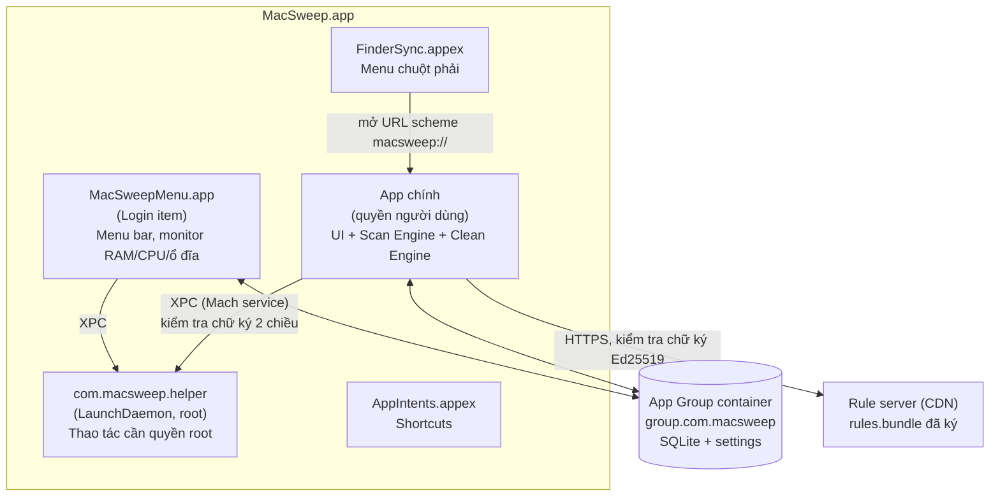

| Tiến trình | Loại | Quyền | Vòng đời | Trách nhiệm |
|---|---|---|---|---|
| `MacSweep` | App | Người dùng + FDA | Người dùng mở | UI, quét, lập kế hoạch xoá, xoá file thuộc người dùng |
| `MacSweepMenu` | Login item (`SMAppService.loginItem`) | Người dùng | Chạy từ khi đăng nhập | Icon menu bar, số liệu hệ thống, cảnh báo ổ đầy, lối tắt mở app |
| `com.macsweep.helper` | LaunchDaemon (`SMAppService.daemon`) | root | launchd bật khi có kết nối XPC, tự thoát khi rảnh | Xoá file hệ thống, chạy lệnh bảo trì, gỡ LaunchDaemon |
| `FinderSync.appex` | Extension | Sandbox | Finder quản lý | "Gỡ bằng MacSweep", "Phân tích thư mục này" |
| `AppIntents.appex` | Extension | Sandbox | Hệ thống quản lý | Shortcut: "Dọn rác", "Dung lượng trống còn bao nhiêu" |

### 3.2 Nguyên tắc phân chia

1. **Quyền tối thiểu.** Mọi việc làm được với quyền người dùng thì làm ở app chính. Helper chỉ nhận các lệnh **có tên cụ thể và tham số được kiểm tra**, không bao giờ nhận lệnh shell tuỳ ý.
2. **Quét ở app, không quét ở helper.** Helper không quét đệ quy và không trả về cây file. App gửi danh sách đường dẫn cụ thể sang, helper kiểm tra từng đường dẫn rồi mới xoá.
3. **Logic dùng chung nằm trong package.** Menu bar và extension link các package domain cần thiết, không gọi ngược sang app chính.

### 3.3 Bố cục bundle

```
MacSweep.app/Contents/
├── MacOS/MacSweep
├── Library/
│   ├── LaunchDaemons/com.macsweep.helper.plist     # SMAppService.daemon
│   ├── LoginItems/MacSweepMenu.app                 # SMAppService.loginItem
│   └── HelperTools/com.macsweep.helper             # binary của helper
├── PlugIns/FinderSync.appex
├── Extensions/AppIntents.appex
├── Frameworks/Sparkle.framework
├── Resources/
│   ├── Rules/rules.bundle                          # bộ rule đi kèm bản cài
│   └── Assets.car
└── Info.plist
```

---

## 4. Cấu trúc mã nguồn và module

### 4.1 Repo

```
MacSweep/
├── App/                       # target app chính (chỉ composition root + entry)
├── MenuBar/                   # target login item
├── Helper/                    # target helper (command-line tool)
├── Extensions/
│   ├── FinderSync/
│   └── AppIntents/
├── Packages/
│   ├── Foundation/
│   │   ├── SweepCore/         # model chung, Result, ByteCount, PathPolicy
│   │   ├── SweepLogging/
│   │   ├── SweepStorage/      # GRDB, migrations
│   │   ├── SweepIPC/          # protocol XPC dùng chung app <-> helper
│   │   └── SweepPermissions/  # kiểm tra FDA, Automation
│   ├── Engine/
│   │   ├── ScanEngine/        # DAG task, scheduler, progress
│   │   ├── NodeTree/          # cây kết quả, selection, aggregation
│   │   ├── CleanEngine/       # clean queue, removers
│   │   ├── FileSystemKit/     # enumerator nhanh, tính dung lượng, APFS
│   │   └── RuleEngine/        # load, verify, evaluate rule
│   ├── Features/
│   │   ├── SystemJunk/        # mỗi feature: <X>Scanning, <X>Domain, <X>UI
│   │   ├── Uninstaller/
│   │   ├── SpaceLens/
│   │   ├── Maintenance/
│   │   ├── LoginItems/
│   │   ├── LargeOldFiles/
│   │   ├── Duplicates/
│   │   └── SmartScan/
│   └── UI/
│       ├── DesignSystem/
│       └── SharedUI/
├── Rules/                     # nguồn rule dạng JSON (xem mục 8)
├── Tools/
│   └── rulepack/              # CLI đóng gói + ký rule
└── Tests/
    └── Fixtures/              # cây thư mục giả lập cho test
```

### 4.2 Các tầng trong một feature

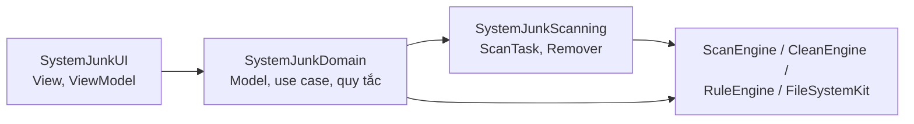

Quy tắc phụ thuộc:

- `UI` → `Domain` → `Scanning` → `Engine` → `Foundation`. Không có chiều ngược lại.
- Feature không import feature khác. `SmartScan` là ngoại lệ duy nhất: nó gom scan task từ các feature qua protocol `FeatureScanProvider`, không import UI của chúng.
- `Helper` chỉ link `SweepIPC`, `SweepCore`, `SweepLogging` và một phần `CleanEngine` (remover cấp thấp), để binary nhỏ và ít bề mặt tấn công.

### 4.3 Composition root

App chính dùng một container phụ thuộc đơn giản, tự viết, không cần thư viện DI:

```swift
@MainActor
final class AppEnvironment {
    let storage: Storage
    let ruleStore: RuleStore
    let fileSystem: FileSystemService
    let helper: HelperClient
    let scanEngine: ScanEngine
    let cleanEngine: CleanEngine
    let features: [any FeatureScanProvider]

    init() throws {
        storage = try Storage(url: .appGroupDatabase)
        ruleStore = try RuleStore(bundled: .bundledRules, cache: .rulesCache, publicKey: .rulesPublicKey)
        fileSystem = FileSystemService()
        helper = HelperClient(machServiceName: "com.macsweep.helper")
        scanEngine = ScanEngine(maxConcurrentIO: 4)
        cleanEngine = CleanEngine(fileSystem: fileSystem, helper: helper, storage: storage)
        features = [
            SystemJunkFeature(rules: ruleStore, fs: fileSystem),
            UninstallerFeature(rules: ruleStore, fs: fileSystem),
            MaintenanceFeature(helper: helper),
            LoginItemsFeature(rules: ruleStore, helper: helper),
            LargeOldFilesFeature(fs: fileSystem),
        ]
    }
}
```

---

## 5. Lõi quét: Scan Engine

### 5.1 Khái niệm

| Khái niệm | Mô tả |
|---|---|
| `ScanTask` | Một đơn vị công việc quét, ví dụ "quét cache người dùng" hay "liệt kê app đã cài". Có id, dependency, priority, ước lượng khối lượng |
| `ScanGraph` | DAG các task. Smart Scan là một graph gom task của nhiều feature |
| `ScanContext` | Truyền vào task: dịch vụ hệ thống tệp, rule, kết quả task phụ thuộc, token huỷ, reporter tiến độ |
| `ScanOutput` | Mỗi task trả về một hoặc nhiều `Node` (mục 6) và dữ liệu trung gian cho task sau |
| `ScanSession` | Một lần chạy graph: trạng thái, tiến độ, kết quả, lỗi |

### 5.2 Interface

```swift
public struct ScanTaskID: Hashable, Sendable, RawRepresentable {
    public let rawValue: String
}

public enum ScanPriority: Int, Sendable, Comparable {
    case low = 0, normal = 1, high = 2
}

public protocol ScanTask: Sendable {
    var id: ScanTaskID { get }
    var dependencies: [ScanTaskID] { get }
    var priority: ScanPriority { get }
    /// Trọng số dùng để chia thanh tiến độ tổng (ước lượng, không cần chính xác).
    var estimatedWeight: Double { get }

    func run(context: ScanContext) async throws -> ScanOutput
}

public struct ScanContext: Sendable {
    public let fileSystem: FileSystemService
    public let rules: RuleSnapshot
    public let progress: ProgressReporter
    /// Kết quả của các task phụ thuộc, tra theo id.
    public let upstream: [ScanTaskID: ScanOutput]
}

public struct ScanOutput: Sendable {
    public var nodes: [Node]
    public var artifacts: [ArtifactKey: any Sendable]   // dữ liệu trung gian, ví dụ danh sách app đã cài
    public var warnings: [ScanWarning]
}
```

### 5.3 Scheduler

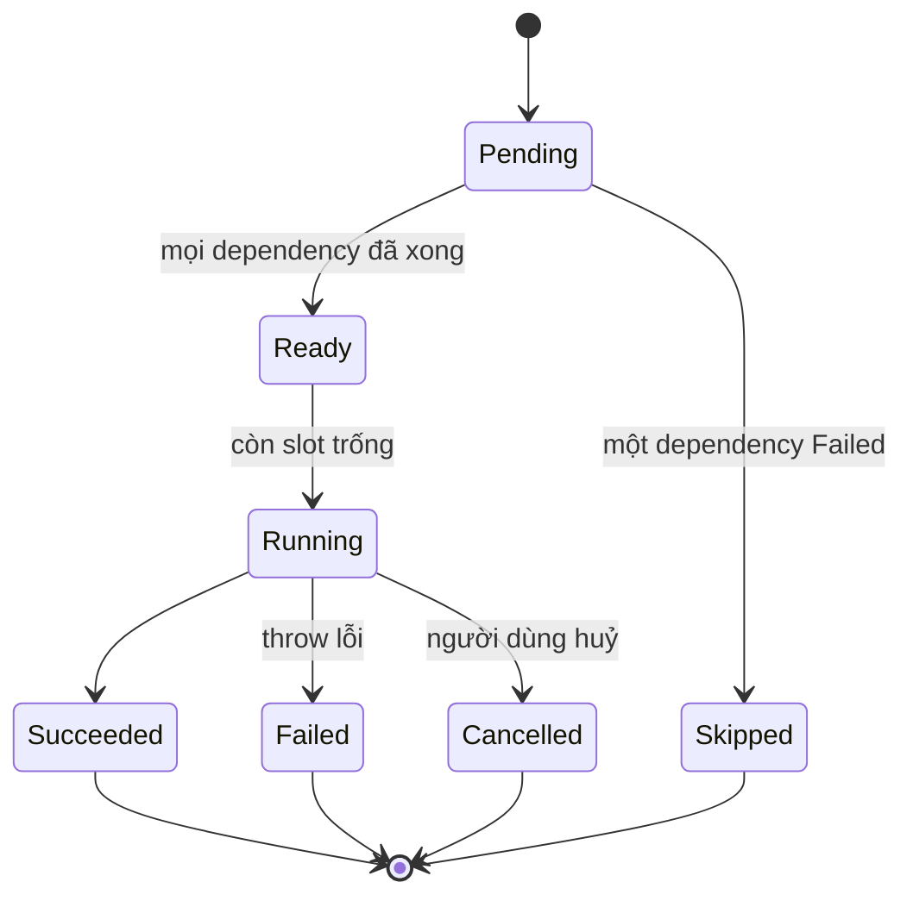

Thuật toán:

1. Kiểm tra graph không có chu trình bằng thuật toán Kahn khi tạo `ScanGraph`; có chu trình thì báo lỗi ngay.
2. Một `actor ScanScheduler` giữ hàng đợi `Ready` sắp theo `(priority desc, estimatedWeight desc)`.
3. Chạy bằng `withThrowingTaskGroup`; số task chạy đồng thời giới hạn bằng `maxConcurrentIO` (mặc định 4 trên SSD, 1 trên HDD; phát hiện qua `URLResourceValues.volumeIsInternal` và IOKit `Medium Type`).
4. Task lỗi: đánh dấu `Failed`, các task phụ thuộc vào nó thành `Skipped`, các nhánh khác vẫn chạy tiếp. Lỗi hiển thị ở mục tương ứng trên UI, không làm hỏng cả phiên quét.
5. Huỷ: `Task.cancel()` lan xuống các task con; mỗi vòng lặp duyệt file gọi `try Task.checkCancellation()` sau mỗi 500 mục.
6. Mỗi task có timeout mềm (mặc định 120 giây). Quá timeout thì huỷ và báo cảnh báo.

### 5.4 Tiến độ

- Mỗi task báo tiến độ trong khoảng `0...1` qua `ProgressReporter`.
- Tiến độ tổng = Σ(weightᵢ × progressᵢ) / Σ weightᵢ.
- Reporter gom cập nhật và đẩy lên UI tối đa 10 lần/giây (throttle) để không làm nghẽn main thread.
- UI hiển thị thêm: tên task đang chạy, số file đã duyệt, dung lượng tìm được tới hiện tại.

### 5.5 Ví dụ graph Smart Scan

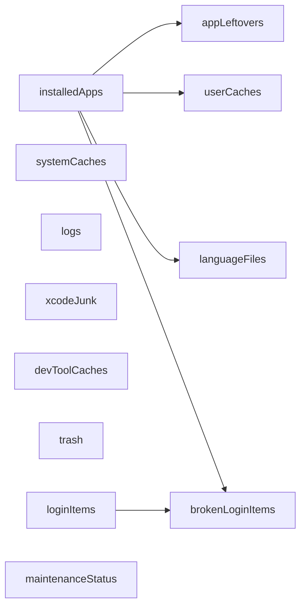

`installedApps` chạy đầu tiên vì nhiều task cần biết app nào đang được cài. Ví dụ: cache của app đã gỡ được xếp vào "file sót", còn cache của app đang dùng xếp vào "cache người dùng".

---

## 6. Cây kết quả: Node Tree

### 6.1 Model

```swift
public struct NodeID: Hashable, Sendable { let rawValue: UUID }

public enum NodeKind: Sendable {
    case group(title: LocalizedStringResource, icon: String)      // "Cache người dùng"
    case application(bundleID: String, url: URL)                  // nhóm theo app
    case file(URL)
    case directory(URL, recursive: Bool)
    case virtual(VirtualItem)                                     // simulator, snapshot, login item...
}

public enum SafetyLevel: Int, Sendable, Comparable {
    case safe = 0          // tự chọn sẵn
    case review = 1        // hiển thị nhưng không tự chọn
    case risky = 2         // ẩn trong "Nâng cao", cần xác nhận
}

public struct Node: Sendable, Identifiable {
    public let id: NodeID
    public let kind: NodeKind
    public var size: ByteCount              // dung lượng thực chiếm (allocated)
    public var itemCount: Int
    public var safety: SafetyLevel
    public var reason: LocalizedStringResource   // vì sao đề xuất xoá
    public var ruleID: RuleID?                   // rule nào tạo ra node này
    public var removal: RemovalStrategy          // cách xoá (mục 7.3)
    public var children: [Node]
    public var lastAccess: Date?
}
```

### 6.2 Trạng thái chọn

- Trạng thái chọn lưu riêng trong `SelectionState` (`[NodeID: Bool]`), không nằm trong `Node`, để cây kết quả bất biến và chia sẻ được giữa các luồng.
- Chọn hoặc bỏ chọn một node cha sẽ áp cho toàn bộ node con. Trạng thái của cha tính từ con: `on`, `off` hoặc `mixed`.
- Dung lượng "sẽ giải phóng" được tính lại theo kiểu tăng dần (chỉ cộng trừ phần thay đổi), không duyệt lại cả cây.
- Lựa chọn mặc định: node có `safety == .safe` được chọn sẵn, còn lại không.

### 6.3 Gộp trùng

Hai rule khác nhau có thể cùng trỏ vào một đường dẫn, ví dụ `~/Library/Caches/com.foo` vừa là "cache người dùng" vừa là "file sót của app Foo". Cách xử lý:

1. Sau khi tất cả task xong, chạy bước `NodeTree.deduplicate()`: dựng một chỉ mục theo đường dẫn chuẩn hoá (`URL.standardizedFileURL` + `resolvingSymlinksInPath`).
2. Một đường dẫn chỉ thuộc **một** node. Ưu tiên theo thứ tự: file sót của app > cache > log > còn lại.
3. Nếu một node là thư mục cha của node khác, giữ node cha và bỏ node con, để không xoá hai lần và không đếm dung lượng hai lần.

### 6.4 Dung lượng trên APFS

- Dùng `URLResourceKey.totalFileAllocatedSizeKey` (dung lượng thực chiếm trên đĩa), không dùng `fileSizeKey` (kích thước logic).
- File clone trên APFS dùng chung block: xoá một bản clone giải phóng ít hơn con số hiển thị. Tạm chấp nhận sai số này trong v1.0 và ghi chú trên UI là "ước tính".
- Hard link: theo dõi cặp `(volume, fileResourceIdentifierKey)` để chỉ đếm một lần.
- File "dataless" của iCloud hoặc File Provider (chưa tải về máy): đọc `ubiquitousItemDownloadingStatusKey` và bỏ qua; xoá chúng chỉ xoá trên cloud chứ không giải phóng ổ.

---

## 7. Lõi dọn dẹp: Clean Engine

### 7.1 Luồng xoá

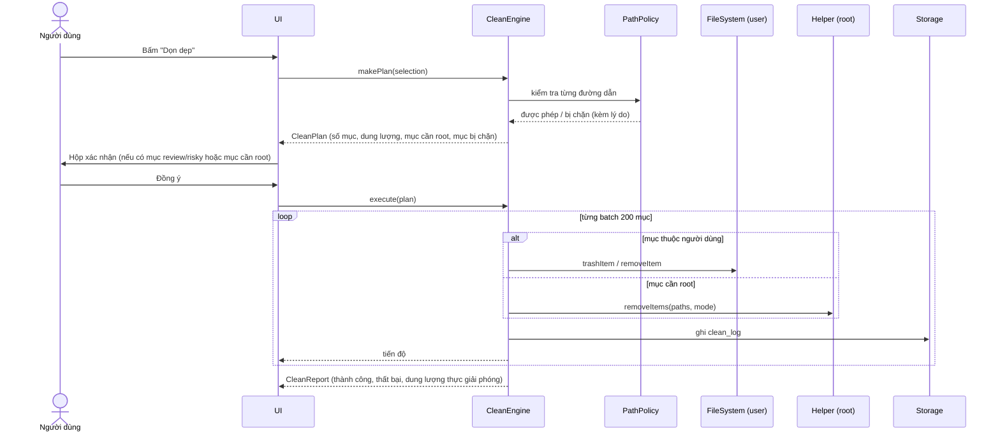

### 7.2 CleanPlan

```swift
public struct CleanPlan: Sendable {
    public struct Item: Sendable {
        let nodeID: NodeID
        let url: URL?
        let strategy: RemovalStrategy
        let requiresRoot: Bool
        let expectedSize: ByteCount
    }
    public var items: [Item]
    public var blocked: [(URL, PathPolicy.Violation)]
    public var totalSize: ByteCount
    public var requiresConfirmation: Bool
}
```

Lập kế hoạch tách khỏi thực thi để:

- Hiển thị cho người dùng chính xác những gì sắp xảy ra trước khi làm.
- Kiểm tra lại `PathPolicy` ngay trước khi xoá (file có thể đã thay đổi kể từ lúc quét).
- Ghi lại kế hoạch vào database, phục vụ báo cáo và khôi phục.

### 7.3 Chiến lược xoá (Remover)

```swift
public enum RemovalStrategy: Sendable {
    case moveToTrash                  // mặc định cho file người dùng
    case delete                       // cache, log: xoá thẳng (tái tạo được)
    case deleteContents               // giữ thư mục, xoá nội dung (vd Caches/<bundle>)
    case custom(RemoverID)            // remover chuyên biệt
}

public protocol Remover: Sendable {
    var id: RemoverID { get }
    func remove(_ items: [CleanPlan.Item], context: RemoveContext) async -> [RemoveResult]
}
```

| Remover | Dùng cho | Cách làm |
|---|---|---|
| `FileRemover` | File và thư mục thông thường | `FileManager.trashItem` hoặc `removeItem`; thư mục lớn thì xoá từ lá lên gốc để báo tiến độ |
| `PrivilegedFileRemover` | `/Library/Caches`, `/private/var/log`, file của root | Gửi sang helper theo batch |
| `SimulatorRemover` | Thiết bị simulator Xcode | `xcrun simctl delete <udid>` hoặc `simctl delete unavailable` |
| `SimulatorRuntimeRemover` | Runtime simulator đã tải | `xcrun simctl runtime delete <id>` |
| `LaunchItemRemover` | LaunchAgent/Daemon hỏng hoặc của app đã gỡ | `launchctl bootout` rồi xoá plist (Daemon thì qua helper) |
| `LocalSnapshotRemover` | Snapshot Time Machine cục bộ | Helper chạy `tmutil deletelocalsnapshots <date>` |
| `AppRemover` | Gỡ app | Tắt app nếu đang chạy, chuyển `.app` vào Thùng rác, rồi xoá file sót |

### 7.4 Xử lý lỗi khi xoá

| Lỗi | Xử lý |
|---|---|
| File đang bị khoá (`EBUSY`) hoặc app đang mở | Bỏ qua mục đó, báo "đang được sử dụng", gợi ý tắt app |
| Không có quyền (`EPERM`/`EACCES`) với file người dùng | Thử lại qua helper nếu đường dẫn nằm trong danh sách root cho phép; nếu không thì báo lỗi |
| SIP chặn (`EPERM` trong vùng được bảo vệ) | Không thử lại; đánh dấu rule đó cần xem lại |
| File không còn tồn tại | Coi như thành công, dung lượng giải phóng tính bằng 0 |
| Thùng rác nằm trên ổ khác hoặc ổ mạng | Hỏi người dùng có muốn xoá vĩnh viễn không |

### 7.5 Dung lượng thực giải phóng

Đo `volumeAvailableCapacityForImportantUsageKey` trước và sau khi dọn, rồi báo con số thực tế bên cạnh con số ước tính. Hai số có thể lệch nhau do snapshot APFS giữ lại block hoặc do file clone.

---

## 8. Bộ rule và Knowledge Base

### 8.1 Vì sao cần rule

Phần lớn "trí tuệ" của app dọn dẹp nằm ở chỗ biết **đường dẫn nào xoá được an toàn**. Nếu viết cứng trong code, mỗi lần bổ sung một app mới lại phải phát hành bản mới. Tách rule ra thành dữ liệu thì:

- Cập nhật rule hằng tuần mà không cần cập nhật app.
- Người không phải lập trình viên cũng viết và review rule được.
- Viết được test tự động cho từng rule.

### 8.2 Schema rule (JSON)

```json
{
  "id": "devtools.npm.cache",
  "version": 3,
  "category": "devToolCaches",
  "title": { "en": "npm cache", "vi": "Cache của npm" },
  "reason": {
    "en": "Downloaded packages; npm re-downloads them when needed.",
    "vi": "Gói đã tải về; npm sẽ tự tải lại khi cần."
  },
  "safety": "safe",
  "removal": "deleteContents",
  "requiresRoot": false,
  "match": {
    "paths": ["~/.npm/_cacache"],
    "minAgeDays": 0
  },
  "conditions": {
    "appNotRunning": [],
    "minOS": "13.0"
  },
  "exclude": []
}
```

Ví dụ rule theo app, dùng biến:

```json
{
  "id": "app.generic.caches",
  "category": "userCaches",
  "safety": "safe",
  "removal": "deleteContents",
  "match": {
    "forEachInstalledApp": true,
    "paths": [
      "~/Library/Caches/${bundleID}",
      "~/Library/Containers/${bundleID}/Data/Library/Caches"
    ]
  },
  "conditions": { "appNotRunning": ["${bundleID}"] },
  "exclude": [
    "~/Library/Caches/com.apple.*",
    "~/Library/Caches/CloudKit"
  ]
}
```

### 8.3 Các trường

| Trường | Kiểu | Ý nghĩa |
|---|---|---|
| `id` | string, duy nhất | Định danh ổn định; database dùng để lưu ignore list |
| `category` | enum | Nhóm hiển thị trên UI |
| `safety` | `safe` / `review` / `risky` | Quyết định có tự chọn sẵn hay không |
| `removal` | `moveToTrash` / `delete` / `deleteContents` / `custom:<id>` | Chiến lược xoá |
| `match.paths` | [glob] | Hỗ trợ `~`, `*`, `**`, biến `${bundleID}`, `${teamID}`, `${appName}`, `${userHome}` |
| `match.forEachInstalledApp` | bool | Áp rule cho từng app trong `installedApps` |
| `match.minAgeDays` | int | Chỉ lấy file không được truy cập/sửa trong N ngày |
| `match.minSizeBytes` | int | Bỏ qua mục nhỏ hơn ngưỡng |
| `conditions.appNotRunning` | [bundleID] | Không đề xuất xoá khi app đang chạy |
| `exclude` | [glob] | Loại trừ, luôn thắng `match` |

### 8.4 Danh mục rule cho bản 1.0

| Nhóm | Đường dẫn chính | An toàn | Xoá |
|---|---|---|---|
| Cache người dùng | `~/Library/Caches/*` (trừ `com.apple.*` nhạy cảm) | safe | deleteContents |
| Cache hệ thống | `/Library/Caches/*` | safe | delete (root) |
| Log người dùng | `~/Library/Logs/*` | safe | delete |
| Log hệ thống | `/Library/Logs/*`, `/private/var/log/*.gz` | safe | delete (root) |
| Báo cáo crash | `~/Library/Logs/DiagnosticReports/*` | safe | delete |
| Xcode DerivedData | `~/Library/Developer/Xcode/DerivedData/*` | safe | delete |
| Xcode Archives | `~/Library/Developer/Xcode/Archives/*` | review | moveToTrash |
| Xcode DeviceSupport | `~/Library/Developer/Xcode/iOS DeviceSupport/*` | review | delete |
| Simulator không dùng | `simctl list` lọc `isAvailable == false` | safe | custom:simulator |
| Homebrew | `~/Library/Caches/Homebrew/*` | safe | deleteContents |
| npm / yarn / pnpm | `~/.npm/_cacache`, `~/Library/Caches/Yarn`, `~/Library/pnpm/store` | safe | deleteContents |
| pip / Poetry | `~/Library/Caches/pip`, `~/Library/Caches/pypoetry` | safe | deleteContents |
| Gradle / Maven | `~/.gradle/caches`, `~/.m2/repository` | review | deleteContents |
| CocoaPods | `~/Library/Caches/CocoaPods` | safe | deleteContents |
| Docker | Không xoá trực tiếp; gợi ý chạy `docker system prune` | review | custom:docker |
| Gói ngôn ngữ | `<App>.app/Contents/Resources/*.lproj` không thuộc ngôn ngữ đang dùng | risky | delete |
| iOS backup | `~/Library/Application Support/MobileSync/Backup/*` | review | moveToTrash |
| Bản cài iOS cũ | `~/Library/iTunes/iPhone Software Updates/*.ipsw` | safe | delete |
| Thùng rác | `~/.Trash`, `/Volumes/*/.Trashes/<uid>` | review | delete |
| Bản tải về cũ | `~/Downloads/*.dmg`, `*.pkg` cũ hơn 30 ngày | review | moveToTrash |
| Mail attachments | `~/Library/Containers/com.apple.mail/Data/Library/Mail Downloads` | review | delete |

Lưu ý khi viết rule ngôn ngữ: xoá `.lproj` bên trong app đã ký **làm hỏng chữ ký code** của app. Vì vậy rule này đặt ở mức `risky`, mặc định tắt và có cảnh báo rõ. Lý do tương tự áp dụng cho thinning binary (mục 11.2).

### 8.5 Đóng gói và ký

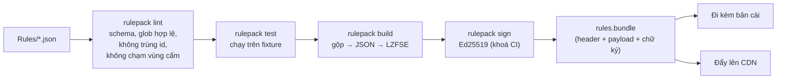

Định dạng file `rules.bundle`:

| Offset | Kích thước | Trường |
|---|---|---|
| 0 | 4 | Magic `MSRB` |
| 4 | 2 | Phiên bản định dạng (`1`) |
| 6 | 8 | Phiên bản rule (`yyyymmddNN`, tăng dần) |
| 14 | 4 | Phiên bản app tối thiểu |
| 18 | 4 | Độ dài payload |
| 22 | n | Payload: JSON nén LZFSE |
| 22+n | 64 | Chữ ký Ed25519 trên các byte `[0, 22+n)` |

Về mã hoá:

- Mục đích chính là **toàn vẹn** (không ai sửa được rule để biến app thành công cụ xoá file tuỳ ý), nên **chữ ký là bắt buộc**.
- Mã hoá payload (AES-GCM) **không bắt buộc**. Khoá giải mã buộc phải nằm trong app, nên mã hoá chỉ làm đối thủ tốn công hơn chứ không ngăn được. Nếu muốn có, dùng `CryptoKit.AES.GCM`, khoá dẫn xuất bằng HKDF, và vẫn ký sau khi mã hoá.
- Public key Ed25519 nhúng trong app. Private key chỉ nằm trong secret của CI, không bao giờ nằm trên máy dev.

```swift
import CryptoKit

struct RuleBundleVerifier {
    let publicKey: Curve25519.Signing.PublicKey

    func verify(_ data: Data) throws -> RuleBundle {
        guard data.count > 22 + 64, data.prefix(4) == Data("MSRB".utf8) else { throw RuleError.badFormat }
        let signed = data.dropLast(64)
        let signature = data.suffix(64)
        guard publicKey.isValidSignature(signature, for: signed) else { throw RuleError.badSignature }
        let header = try RuleBundleHeader(parsing: signed.prefix(22))
        let payload = try (signed.dropFirst(22) as NSData).decompressed(using: .lzfse) as Data
        return try RuleBundle(header: header, json: payload)
    }
}
```

### 8.6 Đánh giá rule khi chạy

1. `RuleStore` nạp bộ rule mới nhất hợp lệ: bộ đã tải về (nếu chữ ký hợp lệ và phiên bản cao hơn) hoặc bộ đi kèm app.
2. Biên dịch glob thành matcher một lần lúc nạp, không biên dịch lại mỗi lần quét.
3. Mở rộng biến theo từng app trong `installedApps`.
4. Mọi đường dẫn sau khi mở rộng đều đi qua `PathPolicy` (mục 15.1). Rule nào trỏ vào vùng cấm sẽ bị loại và ghi log, kể cả khi đã có chữ ký hợp lệ.

---

## 9. Privileged Helper và XPC

### 9.1 Đăng ký helper

Tệp `Contents/Library/LaunchDaemons/com.macsweep.helper.plist`:

```xml
<?xml version="1.0" encoding="UTF-8"?>
<!DOCTYPE plist PUBLIC "-//Apple//DTD PLIST 1.0//EN" "http://www.apple.com/DTDs/PropertyList-1.0.dtd">
<plist version="1.0">
<dict>
    <key>Label</key>
    <string>com.macsweep.helper</string>
    <key>BundleProgram</key>
    <string>Contents/Library/HelperTools/com.macsweep.helper</string>
    <key>MachServices</key>
    <dict>
        <key>com.macsweep.helper</key>
        <true/>
    </dict>
    <key>AssociatedBundleIdentifiers</key>
    <array>
        <string>com.macsweep.app</string>
    </array>
</dict>
</plist>
```

Đăng ký từ app:

```swift
import ServiceManagement

enum HelperInstaller {
    static let service = SMAppService.daemon(plistName: "com.macsweep.helper.plist")

    static func ensureRegistered() throws -> SMAppService.Status {
        switch service.status {
        case .enabled:
            return .enabled
        case .requiresApproval:
            // Người dùng phải bật trong System Settings > General > Login Items
            SMAppService.openSystemSettingsLoginItems()
            return .requiresApproval
        case .notRegistered, .notFound:
            try service.register()
            return service.status
        @unknown default:
            return service.status
        }
    }
}
```

### 9.2 Protocol XPC

Đặt trong package `SweepIPC`, dùng chung cho app và helper:

```swift
@objc public protocol HelperProtocol {
    /// Phiên bản giao thức, để app phát hiện helper cũ cần cập nhật.
    func protocolVersion(reply: @escaping (Int) -> Void)

    /// Xoá danh sách đường dẫn. Helper tự kiểm tra từng đường dẫn với PathPolicy phía root.
    func removeItems(_ paths: [String], mode: Int, reply: @escaping (Data) -> Void)   // Data = JSON [RemoveResult]

    /// Chạy một tác vụ bảo trì có tên. Không nhận lệnh shell tự do.
    func runMaintenance(_ task: String, reply: @escaping (Data) -> Void)

    func bootoutLaunchDaemon(label: String, plistPath: String, reply: @escaping (Data) -> Void)
    func thinLocalSnapshots(volume: String, reply: @escaping (Data) -> Void)

    /// Tự gỡ helper (khi người dùng gỡ app).
    func uninstallSelf(reply: @escaping (Bool) -> Void)
}
```

Tham số dùng kiểu cơ bản (`String`, `Int`, `Data`) để tránh rủi ro của `NSSecureCoding` với class tuỳ biến. Kết quả trả về dạng JSON có phiên bản.

### 9.3 Danh sách tác vụ bảo trì

| Tên tác vụ | Lệnh helper chạy (đường dẫn tuyệt đối, tham số cố định) |
|---|---|
| `flushDNS` | `/usr/bin/dscacheutil -flushcache` rồi `/usr/bin/killall -HUP mDNSResponder` |
| `reindexSpotlight` | `/usr/bin/mdutil -E /` |
| `freeRAM` | `/usr/sbin/purge` |
| `runPeriodic` | `/usr/sbin/periodic daily weekly monthly` |
| `thinSnapshots` | `/usr/bin/tmutil thinlocalsnapshots / 999999999999 4` |
| `rebuildLaunchServices` | `/System/Library/Frameworks/CoreServices.framework/Frameworks/LaunchServices.framework/Support/lsregister -kill -r -domain local -domain system -domain user` (chạy với quyền người dùng, không cần helper) |

Helper dùng `Process` với `executableURL` tuyệt đối và mảng `arguments` cố định; không bao giờ gọi qua `/bin/sh -c`.

### 9.4 Bảo mật XPC

Đây là phần dễ bị khai thác nhất trong các app dọn dẹp, nên xác thực ở **cả hai chiều**.

Phía helper (server):

```swift
final class HelperDelegate: NSObject, NSXPCListenerDelegate {
    // Chỉ chấp nhận app chính và app menu bar, ký bởi Team ID của mình.
    static let clientRequirement =
        #"anchor apple generic and certificate leaf[subject.OU] = "ABCDE12345" and "# +
        #"(identifier "com.macsweep.app" or identifier "com.macsweep.menu")"#

    func listener(_ listener: NSXPCListener, shouldAcceptNewConnection conn: NSXPCConnection) -> Bool {
        conn.setCodeSigningRequirement(Self.clientRequirement)   // macOS 13+
        conn.exportedInterface = NSXPCInterface(with: HelperProtocol.self)
        conn.exportedObject = HelperService(peerPID: conn.processIdentifier)
        conn.resume()
        return true
    }
}

let listener = NSXPCListener(machServiceName: "com.macsweep.helper")
let delegate = HelperDelegate()
listener.delegate = delegate
listener.resume()
dispatchMain()
```

Phía app (client):

```swift
let conn = NSXPCConnection(machServiceName: "com.macsweep.helper", options: .privileged)
conn.remoteObjectInterface = NSXPCInterface(with: HelperProtocol.self)
conn.setCodeSigningRequirement(
    #"anchor apple generic and certificate leaf[subject.OU] = "ABCDE12345" and identifier "com.macsweep.helper""#
)
conn.resume()
```

Các biện pháp bổ sung:

1. Bật **Hardened Runtime** cho tất cả binary; không dùng entitlement `com.apple.security.cs.disable-library-validation`, để không ai inject dylib vào app chính rồi mượn kết nối XPC.
2. Helper kiểm tra lại `PathPolicy` phía root cho **mọi** đường dẫn, không tin kết quả kiểm tra từ app.
3. Chống tấn công symlink (TOCTOU): mở file bằng `open(path, O_NOFOLLOW)` hoặc dùng `unlinkat` với file descriptor của thư mục cha; kiểm tra quyền sở hữu thư mục cha trước khi xoá.
4. Giới hạn tốc độ: tối đa 10.000 đường dẫn mỗi lần gọi, mỗi kết nối tối đa 1 tác vụ bảo trì cùng lúc.
5. Ghi log mọi lệnh root vào `os_log` subsystem `com.macsweep.helper`, kèm PID của client.
6. Helper tự thoát sau 60 giây không có kết nối; launchd sẽ bật lại khi cần.

### 9.5 Phiên bản helper

- Lúc khởi động, app gọi `protocolVersion`. Nếu nhỏ hơn phiên bản app cần, app gọi `SMAppService.unregister()` rồi `register()` lại.
- Sau mỗi lần Sparkle cập nhật app, đường dẫn bundle không đổi nên launchd tự dùng binary helper mới ở lần chạy sau.

---

## 10. Quyền truy cập (TCC)

### 10.1 Các quyền cần

| Quyền | Cần cho | Cách kiểm tra | Cách xin |
|---|---|---|---|
| Full Disk Access | Đọc `~/Library/Mail`, `~/Library/Safari`, container của app khác | Thử đọc metadata một đường dẫn được TCC bảo vệ, ví dụ `~/Library/Safari/Bookmarks.plist` hoặc `/Library/Application Support/com.apple.TCC/TCC.db`; lỗi `EPERM` nghĩa là chưa có quyền | Mở `x-apple.systempreferences:com.apple.preference.security?Privacy_AllFiles` và hướng dẫn kéo app vào danh sách |
| Automation (Apple Events) | Chỉ khi cần điều khiển app khác bằng AppleScript; tắt app trước khi gỡ thì dùng `NSRunningApplication.terminate()` trước | `AEDeterminePermissionToAutomateTarget` | Hệ thống tự hỏi lần đầu |
| Login Items / Background | Helper và app menu bar | `SMAppService.status` | `SMAppService.openSystemSettingsLoginItems()` |
| Thông báo | Cảnh báo ổ đầy | `UNUserNotificationCenter.notificationSettings` | `requestAuthorization` |

### 10.2 Luồng onboarding

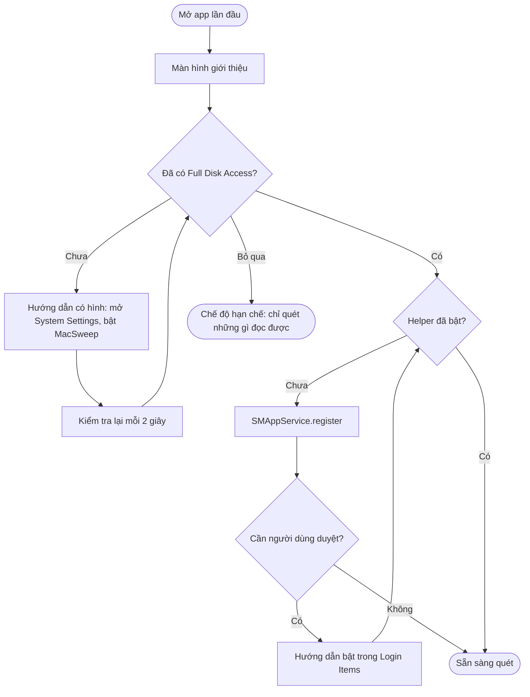

Người dùng được phép bỏ qua Full Disk Access. Khi đó app vẫn chạy, các nhóm không quét được hiện nhãn "Cần Full Disk Access".

---

## 11. Các module tính năng

### 11.1 Smart Scan

- Gom `ScanTask` từ mọi feature có `includeInSmartScan == true` qua protocol:

```swift
public protocol FeatureScanProvider: Sendable {
    var featureID: FeatureID { get }
    var includeInSmartScan: Bool { get }
    func smartScanTasks() -> [any ScanTask]
    func summarize(_ nodes: [Node]) -> FeatureSummary   // 1 dòng + dung lượng cho màn tổng hợp
}
```

- Màn kết quả có 3 thẻ: **Dọn dẹp** (tổng dung lượng an toàn), **Bảo trì** (số tác vụ nên chạy), **Ứng dụng** (số app có file sót).
- Bấm "Chạy" thì thực hiện các mục `safe` của cả 3 thẻ trong một Clean Plan.

### 11.2 System Junk

| Task | Đầu vào | Kết quả |
|---|---|---|
| `userCaches` | Rule `userCaches`, `installedApps` | Node nhóm theo app |
| `systemCaches` | Rule `systemCaches` | Node, đánh dấu `requiresRoot` |
| `logs` | Rule `logs` | Node theo nguồn log |
| `xcodeJunk` | `xcrun simctl list -j`, rule Xcode | DerivedData, Archives, DeviceSupport, simulator, runtime |
| `devToolCaches` | Rule devtools | Node theo tool (npm, brew, pip...) |
| `languageFiles` | `installedApps`, `Locale.preferredLanguages` | Node `risky`, mặc định ẩn |
| `iosBackups` | Đọc `Info.plist` trong từng thư mục backup | Node theo thiết bị, tên + ngày backup |
| `trash` | `~/.Trash`, thùng rác trên ổ ngoài | Node |

Về **universal binary thinning** (CleanMyMac có `UniversalBinaryThinner`): không làm ở v1.0. Gỡ slice bằng `lipo` sửa nội dung binary, làm hỏng chữ ký code; app có thể không chạy, không tự cập nhật được, hoặc bị Gatekeeper chặn. Dung lượng tiết kiệm được trên máy Apple Silicon hiện nay cũng nhỏ.

### 11.3 Uninstaller

**Tìm app đã cài:**

1. Quét `/Applications`, `~/Applications`, `/Applications/Utilities` (độ sâu 2).
2. Bổ sung từ Spotlight: `NSMetadataQuery` với `kMDItemContentType == "com.apple.application-bundle"`.
3. Với mỗi app đọc: bundle ID, tên, phiên bản, Team ID (qua `SecStaticCodeCopySigningInformation`), dung lượng, lần mở cuối (`kMDItemLastUsedDate`), nguồn cài (App Store nếu có `Contents/_MASReceipt`).

**Tìm file sót** của một app (theo thứ tự độ tin cậy):

| Mức | Cách khớp | Ví dụ đường dẫn |
|---|---|---|
| Chắc chắn | Khớp chính xác bundle ID | `~/Library/Containers/<bundleID>`, `~/Library/Preferences/<bundleID>.plist`, `~/Library/Caches/<bundleID>`, `~/Library/HTTPStorages/<bundleID>`, `~/Library/Saved Application State/<bundleID>.savedState` |
| Chắc chắn | Khớp Team ID | `~/Library/Group Containers/<teamID>.*` (chỉ khi không còn app nào khác cùng Team ID) |
| Cao | Khớp tên app trong thư mục chuẩn | `~/Library/Application Support/<AppName>` |
| Cao | LaunchAgent/Daemon có `Program` trỏ vào app | `~/Library/LaunchAgents/*.plist`, `/Library/LaunchDaemons/*.plist` |
| Trung bình | Package receipt | `pkgutil --pkgs` rồi `pkgutil --files <pkgid>` |
| Thấp (chỉ gợi ý) | Tên gần giống | Không tự chọn, `safety = review` |

Rule đặc biệt cho các bộ cài phức tạp (JetBrains Toolbox, Adobe, Microsoft Office, game launcher) viết trong rule JSON dạng `app.<bundleID>.leftovers`, giống cách CleanMyMac có `JetBrainsApplicationFilter` và `BlizzardApplicationFilter`.

**Quy trình gỡ:**

1. Nếu app đang chạy: gửi Apple Event quit, chờ 10 giây, nếu chưa tắt thì hỏi người dùng có muốn buộc tắt không.
2. Nếu app có trình gỡ riêng (ví dụ `Uninstall <App>.app`), gợi ý dùng trình đó trước.
3. Chuyển `.app` vào Thùng rác.
4. Xoá file sót đã chọn.
5. `launchctl bootout` các LaunchAgent/Daemon liên quan.
6. Với gói pkg: `pkgutil --forget <pkgid>` qua helper.

**App bị xoá tay** (kéo thẳng vào Thùng rác): task `orphanedLeftovers` lấy danh sách bundle ID từ tên thư mục trong `~/Library/Containers`, `Preferences`, `Caches`, `Application Support`, rồi loại các bundle ID đang được cài, của Apple hoặc nằm trong whitelist. Phần còn lại xếp nhóm thành "File sót của app đã gỡ", mức `review`.

### 11.4 Space Lens

- Mục đích: bản đồ dung lượng dạng sunburst hoặc treemap, đi sâu dần vào từng thư mục.
- Quét bằng `getattrlistbulk` (mục 16.2), song song theo thư mục con cấp 1.
- Dựng cây tổng hợp trong bộ nhớ, với node gọn nhẹ:

```swift
struct DiskNode {
    var nameIndex: UInt32        // chỉ số vào bảng tên chung (giảm bộ nhớ)
    var size: UInt64
    var firstChild: UInt32       // lưu cây dạng mảng phẳng
    var childCount: UInt32
    var flags: UInt8             // thư mục, package, symlink, không đọc được
}
```

- Mục tiêu bộ nhớ: dưới 200 MB cho 2 triệu file (~64 byte mỗi node kể cả tên).
- Hiển thị: chỉ vẽ node chiếm ≥ 0,5% vùng cha; phần còn lại gộp thành "Các mục nhỏ khác".
- Cập nhật tăng dần bằng FSEvents khi người dùng đang mở màn hình.
- Cho phép chọn file hoặc thư mục rồi xoá qua Clean Engine (mặc định chuyển vào Thùng rác).

### 11.5 Maintenance

| Tác vụ | Khi nào nên chạy | Thực hiện | Cần root |
|---|---|---|---|
| Xoá cache DNS | Lỗi mạng, đổi DNS | `flushDNS` | Có |
| Đánh lại chỉ mục Spotlight | Spotlight tìm sai hoặc chậm | `reindexSpotlight` | Có |
| Giải phóng RAM | Memory pressure cao | `freeRAM` (`purge`) | Có |
| Chạy script định kỳ | Máy hay tắt vào ban đêm | `runPeriodic` | Có |
| Xoá bớt snapshot cục bộ | Dung lượng purgeable lớn | `thinSnapshots` | Có |
| Dựng lại Launch Services | Menu "Open With" bị trùng lặp | `lsregister` | Không |
| Tối ưu Mail | Mail chậm | Xoá `Envelope Index` khi Mail đã tắt, Mail tự dựng lại | Không |

Màn hình hiển thị lần chạy gần nhất của từng tác vụ (lưu trong database) và gợi ý tác vụ nên chạy dựa trên trạng thái hệ thống, ví dụ memory pressure lấy qua `DispatchSource.makeMemoryPressureSource`.

### 11.6 Login Items và Background Items

Nguồn dữ liệu:

| Nguồn | Cách đọc |
|---|---|
| LaunchAgent người dùng | `~/Library/LaunchAgents/*.plist` |
| LaunchAgent / Daemon toàn hệ thống | `/Library/LaunchAgents`, `/Library/LaunchDaemons` |
| Login item hiện đại (`SMAppService`) | Không có API công khai để liệt kê của app khác; hiển thị hướng dẫn mở System Settings |
| Trạng thái đang chạy | `launchctl print gui/<uid>` hoặc `launchctl list` |

Với mỗi mục, hiển thị: tên, app sở hữu (tra `Program` hoặc `ProgramArguments[0]` → bundle), trạng thái, và nhãn **hỏng** khi binary không còn tồn tại. Các thao tác: tắt tạm (`launchctl bootout`), xoá hẳn (bootout rồi xoá plist).

### 11.7 Large & Old Files

- Dùng Spotlight để có kết quả nhanh: `NSMetadataQuery` với `kMDItemFSSize > 100MB` hoặc `kMDItemLastUsedDate < now - 365d`.
- Bổ sung bằng quét trực tiếp các thư mục Spotlight không index (ví dụ thư mục ẩn).
- Bộ lọc: loại file, khoảng dung lượng, khoảng thời gian, thư mục.
- Mặc định không chọn gì; người dùng tự chọn.

### 11.8 Duplicates

Tìm theo 3 bước để giảm I/O:

1. Nhóm theo dung lượng chính xác; bỏ các nhóm chỉ có 1 file và file nhỏ hơn 1 MB.
2. Băm 64 KB đầu + 64 KB cuối (xxHash3); nhóm lại.
3. Băm toàn bộ file (SHA-256) cho các nhóm còn lại.

Bỏ qua file clone APFS (xoá chúng không giải phóng dung lượng): kiểm tra bằng `getattrlist` với `ATTR_CMNEXT_CLONEID` (macOS 10.15+) và `ATTR_CMNEXT_EXT_FLAGS`.

Gợi ý file nên giữ lại: bản nằm trong thư mục "quan trọng" hơn (Documents > Downloads), bản cũ hơn, bản có tên không chứa "copy" hoặc "(1)".

### 11.9 Menu bar (MacSweepMenu)

| Chỉ số | Nguồn |
|---|---|
| CPU | `host_processor_info`, lấy mẫu mỗi 2 giây |
| RAM, memory pressure | `host_statistics64(HOST_VM_INFO64)` + `DispatchSource.makeMemoryPressureSource` |
| Dung lượng trống | `volumeAvailableCapacityForImportantUsageKey` |
| Pin | IOKit `IOPSCopyPowerSourcesInfo` |
| Mạng | `getifaddrs` (`if_data` byte vào/ra) |

Cảnh báo: ổ trống dưới 10% hoặc dưới 10 GB, Thùng rác lớn hơn 5 GB, memory pressure ở mức `critical` kéo dài hơn 5 phút. Mỗi loại cảnh báo tối đa 1 lần mỗi 24 giờ.

---

## 12. Lưu trữ dữ liệu

### 12.1 Vị trí

| Dữ liệu | Vị trí | Ghi chú |
|---|---|---|
| Database | `~/Library/Group Containers/group.com.macsweep/macsweep.sqlite` | App chính và app menu bar cùng đọc |
| Cài đặt | `UserDefaults(suiteName: "group.com.macsweep")` | |
| Rule đã tải về | `~/Library/Application Support/MacSweep/Rules/` | Giữ 2 phiên bản gần nhất |
| Log | `os_log` + file xoay vòng tại `~/Library/Logs/MacSweep/` | |

### 12.2 Schema (GRDB)

```sql
CREATE TABLE scan_session (
    id            TEXT PRIMARY KEY,            -- UUID
    kind          TEXT NOT NULL,               -- smartScan | systemJunk | uninstaller ...
    started_at    REAL NOT NULL,
    finished_at   REAL,
    status        TEXT NOT NULL,               -- running | succeeded | failed | cancelled
    found_bytes   INTEGER NOT NULL DEFAULT 0,
    rules_version INTEGER NOT NULL
);

CREATE TABLE clean_operation (
    id              TEXT PRIMARY KEY,
    session_id      TEXT REFERENCES scan_session(id),
    started_at      REAL NOT NULL,
    finished_at     REAL,
    planned_bytes   INTEGER NOT NULL,
    freed_bytes     INTEGER,                    -- đo thực tế từ dung lượng ổ
    items_ok        INTEGER NOT NULL DEFAULT 0,
    items_failed    INTEGER NOT NULL DEFAULT 0
);

CREATE TABLE clean_item_log (
    operation_id  TEXT NOT NULL REFERENCES clean_operation(id) ON DELETE CASCADE,
    path          TEXT NOT NULL,
    rule_id       TEXT,
    strategy      TEXT NOT NULL,                -- trash | delete | deleteContents | custom
    trashed_path  TEXT,                         -- đường dẫn trong Thùng rác, để khôi phục
    size          INTEGER NOT NULL,
    result        TEXT NOT NULL,                -- ok | skipped | failed:<code>
    PRIMARY KEY (operation_id, path)
);

CREATE TABLE ignore_entry (                      -- người dùng chọn "không bao giờ đề xuất mục này"
    id         INTEGER PRIMARY KEY AUTOINCREMENT,
    kind       TEXT NOT NULL,                   -- path | rule | bundleID
    value      TEXT NOT NULL,
    created_at REAL NOT NULL,
    UNIQUE (kind, value)
);

CREATE TABLE maintenance_run (
    task        TEXT NOT NULL,
    ran_at      REAL NOT NULL,
    result      TEXT NOT NULL,
    PRIMARY KEY (task, ran_at)
);

CREATE TABLE app_usage_cache (                  -- cache thông tin app để quét lần sau nhanh hơn
    bundle_id     TEXT PRIMARY KEY,
    path          TEXT NOT NULL,
    team_id       TEXT,
    version       TEXT,
    size          INTEGER,
    last_used_at  REAL,
    updated_at    REAL NOT NULL
);
```

Migration dùng `DatabaseMigrator` của GRDB; mỗi migration có tên, không bao giờ sửa migration đã phát hành. Mở database ở chế độ WAL để app menu bar đọc được trong lúc app chính ghi.

Dữ liệu cũ: `clean_item_log` giữ 90 ngày, `scan_session` giữ 1 năm; dọn khi app khởi động.

---

## 13. Tiến trình nền: Menu bar và Monitor

- Đăng ký bằng `SMAppService.loginItem(identifier: "com.macsweep.menu")`, có tuỳ chọn bật/tắt trong cài đặt.
- Dùng `NSStatusItem` + popover SwiftUI.
- Bộ nhớ mục tiêu dưới 40 MB, CPU trung bình dưới 0,5%: lấy mẫu mỗi 2 giây khi popover mở, mỗi 30 giây khi đóng.
- Không chạy quét nặng. Khi cần dọn, mở app chính qua URL scheme `macsweep://scan?feature=systemJunk`.
- Theo dõi ổ đĩa qua `NSWorkspace.didMountNotification` / `didUnmountNotification`.
- Giao tiếp với app chính: chỉ qua database và `DistributedNotificationCenter` (thông báo "vừa dọn xong" để cập nhật số liệu), không cần XPC riêng.

---

## 14. Cập nhật app và cập nhật rule

### 14.1 App

- Sparkle 2 với appcast ký EdDSA.
- Kênh `stable` và `beta`, người dùng chọn trong cài đặt.
- Bản cập nhật chứa helper mới: sau khi cài, app so `protocolVersion` và đăng ký lại helper nếu cần (mục 9.5).

### 14.2 Rule

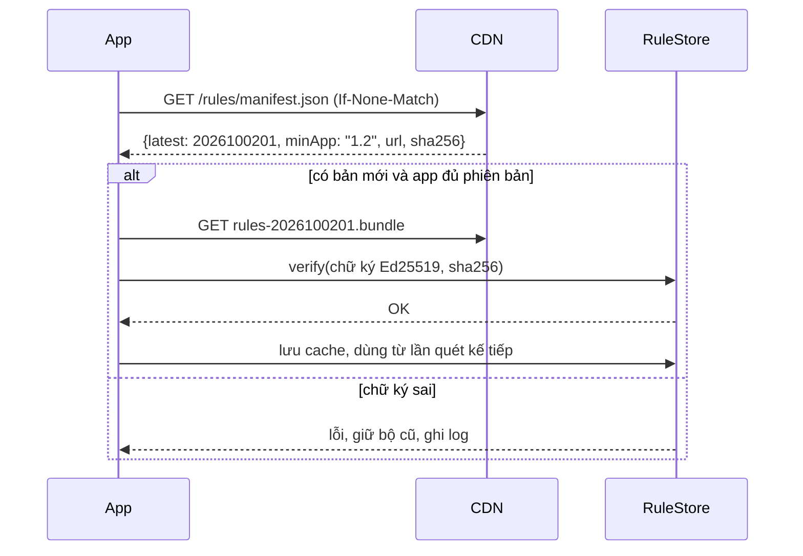

- Kiểm tra 1 lần mỗi 24 giờ và khi app khởi động (nếu lần kiểm tra trước đã quá 24 giờ).
- Rollback: chỉ cần phát hành bộ rule mới có số phiên bản cao hơn. App không bao giờ chấp nhận phiên bản thấp hơn bộ đang dùng, để chống tấn công hạ cấp.
- Kill switch: manifest có thể chứa `disabledRules: ["id1", "id2"]` để tắt ngay một rule lỗi.

---

## 15. An toàn dữ liệu

Đây là yêu cầu quan trọng nhất của một app dọn dẹp. Chỉ một lần xoá nhầm là mất niềm tin của người dùng.

### 15.1 PathPolicy

Một module duy nhất quyết định đường dẫn nào được phép xoá. Cả app và helper đều dùng nó, và helper chạy lại kiểm tra ở phía root.

**Luôn cấm** (không rule nào vượt qua được):

```
/
/System/**
/usr/**            (trừ /usr/local/** theo rule riêng)
/bin/** /sbin/**
/private/var/db/**
/Library/Apple/**
~/                 (chính thư mục home)
~/Documents  ~/Desktop  ~/Pictures  ~/Movies  ~/Music  (chính thư mục, không phải nội dung)
~/Library          (chính thư mục)
~/Library/Keychains/**
~/Library/Mobile Documents/**      (iCloud Drive)
~/Library/Messages/**
~/Library/Photos/**  *.photoslibrary/**
Mọi đường dẫn nằm trên volume chỉ đọc hoặc volume hệ thống (Signed System Volume)
```

**Kiểm tra bổ sung:**

1. Chuẩn hoá đường dẫn: bỏ `..`, giải symlink. Đường dẫn sau khi chuẩn hoá phải vẫn nằm trong vùng mà rule cho phép.
2. Chủ sở hữu file: với thao tác ở quyền người dùng, file phải thuộc user hiện tại; với helper, chỉ xoá file của root/wheel trong vùng hệ thống được rule khai báo.
3. Mục lớn bất thường (thư mục > 50 GB mà rule loại `cache`) thì hạ xuống `review` và yêu cầu xác nhận.
4. File đang được mở (`proc_listpidspath` hoặc `lsof`): bỏ qua.

### 15.2 Mặc định an toàn

| Loại dữ liệu | Mặc định |
|---|---|
| File do người dùng tạo (Downloads, file lớn, file trùng) | Chuyển vào Thùng rác, không bao giờ tự chọn |
| Cache, log | Xoá thẳng, tự chọn nếu rule `safe` |
| App | Chuyển vào Thùng rác |
| Mọi thứ cần root | Hiện hộp xác nhận liệt kê chi tiết |

### 15.3 Khôi phục

- Với mục chuyển vào Thùng rác: `clean_item_log.trashed_path` lưu vị trí, màn "Lịch sử" có nút "Khôi phục" để chuyển về vị trí cũ.
- Với mục xoá thẳng: không khôi phục được. Vì vậy chỉ rule đã được kiểm chứng là tái tạo được (cache, log) mới dùng `delete`.

### 15.4 Chế độ thử (Dry run)

Cài đặt ẩn `--dry-run` (biến môi trường hoặc tuỳ chọn trong menu Debug): chạy toàn bộ luồng nhưng không xoá gì, chỉ ghi ra danh sách. Dùng cho QA và khi review rule mới.

---

## 16. Hiệu năng

### 16.1 Mục tiêu

| Thao tác | Mục tiêu (MacBook Air M1, SSD 512 GB, ~1 triệu file) |
|---|---|
| Mở app đến khi giao diện dùng được | < 1 giây |
| Smart Scan | < 30 giây |
| Space Lens toàn ổ | < 60 giây |
| Duplicates trên thư mục home | < 3 phút |
| Bộ nhớ app chính khi quét | < 500 MB |

### 16.2 Duyệt hệ thống tệp

| Cách | Tốc độ | Dùng khi |
|---|---|---|
| `FileManager.enumerator(at:includingPropertiesForKeys:)` có prefetch key | Trung bình | Quét theo rule, số file vừa phải |
| `fts_open` / `fts_read` | Nhanh | Duyệt cây sâu |
| `getattrlistbulk` | Nhanh nhất (lấy tên, loại, dung lượng của nhiều mục trong 1 syscall) | Space Lens, quét toàn ổ |
| Spotlight (`NSMetadataQuery`) | Gần như tức thì | File lớn/cũ, tìm app |

`FileSystemKit` bọc các cách trên sau một interface chung:

```swift
public protocol DirectoryWalker: Sendable {
    func walk(
        _ root: URL,
        options: WalkOptions,                  // độ sâu, bỏ qua package, bỏ qua thư mục ẩn
        visit: @Sendable (Entry) throws -> WalkDecision   // .continue | .skipDescendants | .stop
    ) async throws
}

public struct Entry: Sendable {
    public let path: FilePath
    public let isDirectory: Bool
    public let allocatedSize: UInt64
    public let modificationDate: Date
    public let accessDate: Date?
    public let fileID: UInt64
    public let isPackage: Bool
}
```

### 16.3 Các kỹ thuật khác

- Không theo symlink khi duyệt; không đi qua ranh giới volume (`volumeIdentifierKey`).
- Bỏ qua sớm thư mục khớp `exclude` hoặc nằm trong danh sách cấm, không đi vào bên trong.
- Cache `installedApps` trong `app_usage_cache`; chỉ đọc lại app có `modificationDate` thay đổi.
- Tính dung lượng thư mục song song theo thư mục con cấp 1, giới hạn đồng thời theo loại ổ.
- Đặt QoS `.utility` cho task quét để không làm chậm việc khác của người dùng; Space Lens khi người dùng đang xem thì dùng `.userInitiated`.
- UI cây lớn (> 10.000 node) dùng `NSOutlineView` bọc trong `NSViewRepresentable` thay cho `List` của SwiftUI.

---

## 17. Logging, chẩn đoán, thống kê

- `os_log` với subsystem `com.macsweep`, category theo module (`scan`, `clean`, `helper`, `rules`, `ui`).
- Không ghi đường dẫn đầy đủ trong log ở mức `info`; dùng `privacy: .private` để macOS che khi xuất log.
- Màn "Gửi báo cáo lỗi": gom log 24 giờ gần nhất, phiên bản app/rule/macOS, kết quả kiểm tra quyền; người dùng xem trước nội dung rồi mới gửi.
- Thống kê ẩn danh: tắt mặc định, chỉ bật khi người dùng đồng ý. Chỉ gửi số liệu tổng hợp (dung lượng dọn theo nhóm, thời gian quét, rule nào hay lỗi), không gửi đường dẫn hay tên file.
- Crash report: dùng crash reporter của macOS và MetricKit (`MXCrashDiagnostic`, macOS 12+); không cần SDK bên thứ ba.

---

## 18. Kiểm thử

| Mức | Nội dung | Công cụ |
|---|---|---|
| Unit | PathPolicy (mọi đường dẫn cấm), mở rộng glob và biến của rule, dedupe Node Tree, tính tiến độ, scheduler DAG | Swift Testing |
| Rule | Mỗi rule chạy trên cây thư mục giả lập trong `Tests/Fixtures`, so với danh sách kỳ vọng | `rulepack test` |
| Tích hợp | Scan → Plan → Clean trên thư mục tạm có nội dung thật | XCTest với thư mục tạm |
| Helper | Kết nối XPC từ binary ký sai phải bị từ chối; đường dẫn chứa symlink trỏ vào `/System` phải bị chặn | Test riêng chạy trên máy CI có quyền admin |
| Hiệu năng | Quét fixture 1 triệu file, theo dõi thời gian và bộ nhớ qua các bản | `XCTMetric`, chạy hằng đêm |
| Thủ công | Ma trận macOS 13, 14, 15, 26 × Intel, Apple Silicon × có/không FDA | Máy ảo (Virtualization.framework, UTM) |

Bắt buộc trước mỗi bản phát hành: chạy toàn bộ luồng dọn ở chế độ dry run trên máy thật của ít nhất 3 người trong đội, rồi đối chiếu danh sách xoá.

---

## 19. Build, ký, phân phối

1. Xcode project chỉ chứa các target (app, menu, helper, extension); mã nằm trong Swift package.
2. Ký Developer ID Application, bật Hardened Runtime cho mọi binary.
3. Entitlements app chính: không sandbox; `com.apple.security.application-groups` = `group.com.macsweep` (bản Developer ID trên macOS 15+ cần khai báo App Group với tiền tố Team ID, hoặc cấu hình trong provisioning profile); `com.apple.security.automation.apple-events` = true.
4. Notarize bằng `xcrun notarytool submit --wait`, rồi `xcrun stapler staple`.
5. Đóng gói DMG có nền hướng dẫn kéo vào Applications.
6. CI (GitHub Actions trên runner macOS): build → test → `rulepack lint/test` → ký → notarize → tạo appcast Sparkle → upload.

---

## 20. Lộ trình phát triển

| Giai đoạn | Thời lượng ước tính | Nội dung | Tiêu chí hoàn thành |
|---|---|---|---|
| 0. Nền móng | 3 tuần | Repo, package, `FileSystemKit`, `PathPolicy`, `ScanEngine`, `NodeTree`, Storage | Quét được `~/Library/Caches` và hiển thị cây kết quả |
| 1. Dọn rác (MVP) | 4 tuần | `RuleEngine`, 20 rule đầu tiên, `CleanEngine` quyền người dùng, UI System Junk | Dọn cache/log/dev tool an toàn, có lịch sử và khôi phục |
| 2. Helper | 3 tuần | `SMAppService`, XPC, bảo mật hai chiều, tác vụ root, Maintenance | Xoá cache hệ thống, chạy 6 tác vụ bảo trì; test bảo mật đạt |
| 3. Uninstaller | 3 tuần | Tìm app, tìm file sót, gỡ, file sót của app đã gỡ | Gỡ sạch 20 app phổ biến, đối chiếu thủ công |
| 4. Space Lens + File lớn | 3 tuần | `getattrlistbulk`, treemap/sunburst, Large & Old | Đạt mục tiêu hiệu năng mục 16.1 |
| 5. Smart Scan + Menu bar | 2 tuần | Gom task, màn tổng hợp, app menu bar | Một nút quét chạy đủ các feature |
| 6. Hoàn thiện | 3 tuần | Onboarding, Duplicates, Login Items, cập nhật rule từ xa, Sparkle | Bản beta |
| 7. Beta và phát hành | 4 tuần | Sửa lỗi, mở rộng rule, tài liệu | Bản 1.0 |

Tổng cộng khoảng 25 tuần cho 1–2 lập trình viên.

---

## 21. Câu hỏi còn mở

1. Hỗ trợ từ macOS 13 (đề xuất của tài liệu này) hay lùi về macOS 11 như CleanMyMac? Lùi về 11 thì phải giữ thêm nhánh SMJobBless.
2. Mô hình kinh doanh: mua một lần, thuê bao, hay miễn phí kèm bản Pro? Câu trả lời ảnh hưởng tới hệ thống license và tài khoản (chưa thiết kế trong tài liệu này).
3. Có làm bản CLI không (CleanMyMac có App Group `...CLI`)? Nếu có, CLI dùng chung `ScanEngine` và `RuleEngine`, và cần thêm một target.
4. Có đưa quét malware vào bản 2.0 không? Nếu có, cần đánh giá dùng engine nguồn mở (YARA + bộ chữ ký công khai) hay mua engine thương mại.
5. Ngôn ngữ giao diện: tiếng Việt và tiếng Anh từ bản 1.0?

---

## 22. Stack công nghệ chi tiết và cách sử dụng

### 22.1 Bản đồ stack theo tầng

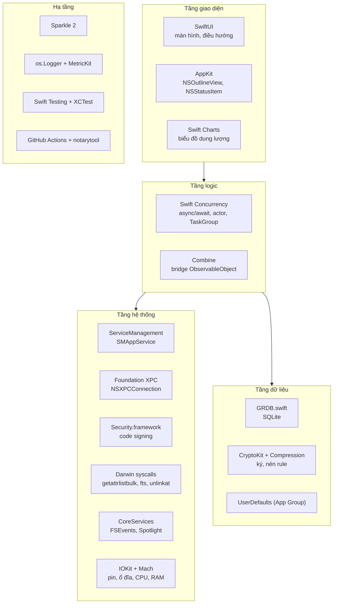

### 22.2 Bảng tổng hợp

| Công nghệ | Phiên bản / yêu cầu | Dùng ở đâu | Vì sao chọn |
|---|---|---|---|
| Swift 6 | Xcode 16+ | Toàn bộ | Strict concurrency bắt lỗi race ngay lúc biên dịch |
| SwiftUI | macOS 13+ | Mọi màn hình | Viết UI nhanh, dễ làm animation |
| AppKit | macOS 13+ | Cây kết quả lớn, menu bar | `List` của SwiftUI chậm khi có trên 10.000 dòng |
| Swift Charts | macOS 13+ | Biểu đồ dung lượng, lịch sử dọn | Có sẵn trong hệ thống, không cần thư viện ngoài |
| `ObservableObject` + `@Published` | macOS 13+ | ViewModel | `@Observable` (Observation) cần macOS 14; khi nâng min lên 14 thì chuyển sang |
| Swift Concurrency | macOS 13+ | Scan Engine, Clean Engine, XPC client | Huỷ task, giới hạn đồng thời, actor bảo vệ state |
| Swift Package Manager | | Chia module | Liên kết tĩnh, build song song, test độc lập |
| ServiceManagement (`SMAppService`) | macOS 13+ | Cài helper root, login item | API chính thức thay SMJobBless |
| `NSXPCConnection` | | App ↔ helper | Có xác thực code signing tích hợp (macOS 13+) |
| Security.framework | | Đọc Team ID của app, kiểm tra chữ ký | Xác định chủ sở hữu file sót, phát hiện app bị sửa |
| Darwin (`getattrlistbulk`, `fts`, `unlinkat`, `open(O_NOFOLLOW)`) | | `FileSystemKit`, helper | Duyệt nhanh nhất; xoá an toàn trước tấn công symlink |
| FSEvents | | Space Lens, cập nhật kết quả | Biết thư mục nào vừa thay đổi mà không phải quét lại |
| Spotlight (`NSMetadataQuery`) | | Tìm app, file lớn/cũ | Kết quả gần như tức thì từ chỉ mục có sẵn |
| IOKit, Mach (`host_statistics64`, `host_processor_info`) | | Menu bar | Số liệu CPU, RAM, pin |
| GRDB.swift | 7.x | Database | Migration, WAL, `ValueObservation` để UI tự cập nhật |
| CryptoKit | | Ký, kiểm tra rule (Ed25519), băm (SHA-256) | Có sẵn, nhanh, API an toàn |
| Compression (LZFSE) | | Nén rule bundle | Có sẵn, nén tốt cho JSON |
| xxHash (C, giấy phép BSD) | Nhúng qua C target của SPM | Băm nhanh khi tìm file trùng | Nhanh hơn SHA-256 nhiều lần ở bước lọc sơ bộ |
| Sparkle | 2.x | Tự cập nhật | Chuẩn de facto cho app ngoài App Store |
| UserNotifications | | Cảnh báo ổ đầy | |
| FinderSync | | Menu chuột phải trong Finder | |
| App Intents | macOS 13+ | Shortcuts, Spotlight action | |
| `os.Logger` | | Log | Hiệu năng cao, che dữ liệu riêng tư |
| MetricKit | macOS 12+ | Crash, hang, hiệu năng | Không cần SDK bên thứ ba |
| Swift Testing + XCTest | | Unit test (Swift Testing), test hiệu năng (`XCTMetric`) | |
| SwiftLint, SwiftFormat | | CI | Giữ code đồng nhất |
| `xcrun notarytool`, `stapler` | | Phát hành | Bắt buộc với Developer ID |
| GitHub Actions (runner macOS) | | CI/CD | |

### 22.3 Cách sử dụng từng công nghệ

#### SwiftUI + ViewModel: trạng thái của một màn tính năng

Mọi màn tính năng (System Junk, Uninstaller...) theo cùng một máy trạng thái:

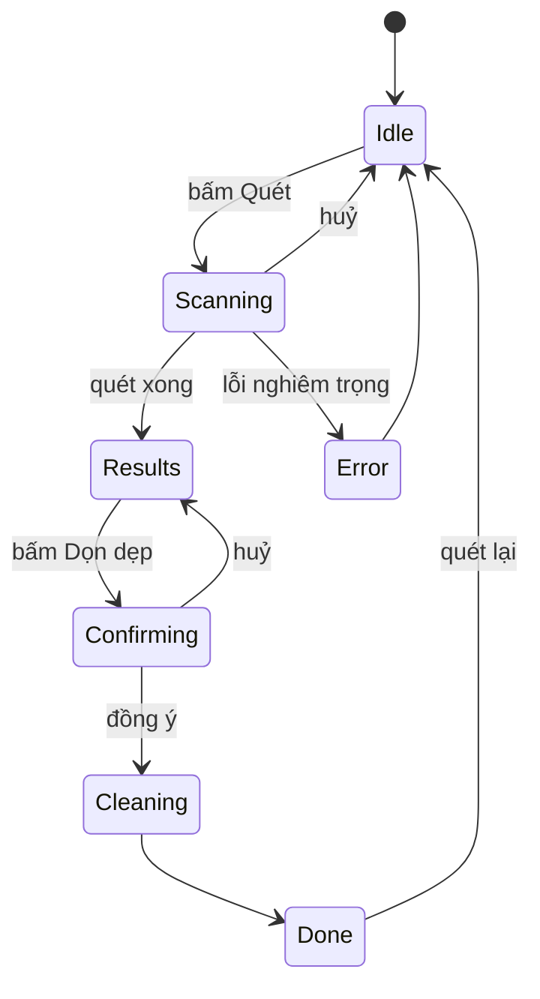

```swift
@MainActor
final class SystemJunkViewModel: ObservableObject {
    enum Phase {
        case idle
        case scanning(progress: Double, currentTask: String)
        case results(NodeTree)
        case confirming(CleanPlan)
        case cleaning(progress: Double)
        case done(CleanReport)
        case error(String)
    }

    @Published private(set) var phase: Phase = .idle
    @Published var selection = SelectionState()

    private let feature: SystemJunkFeature
    private let scanEngine: ScanEngine
    private let cleanEngine: CleanEngine
    private var scanTask: Task<Void, Never>?

    func startScan() {
        scanTask = Task {
            do {
                let graph = try ScanGraph(tasks: feature.scanTasks())
                for try await event in scanEngine.run(graph) {
                    switch event {
                    case let .progress(value, name):
                        phase = .scanning(progress: value, currentTask: name)
                    case let .finished(tree):
                        selection = .defaults(for: tree)        // chọn sẵn mục safe
                        phase = .results(tree)
                    }
                }
            } catch is CancellationError {
                phase = .idle
            } catch {
                phase = .error(error.localizedDescription)
            }
        }
    }

    func cancel() { scanTask?.cancel() }

    func prepareClean() async {
        guard case let .results(tree) = phase else { return }
        let plan = await cleanEngine.makePlan(tree: tree, selection: selection)
        phase = .confirming(plan)
    }
}
```

```swift
struct SystemJunkView: View {
    @StateObject var model: SystemJunkViewModel

    var body: some View {
        switch model.phase {
        case .idle:                    IdleView(onScan: model.startScan)
        case let .scanning(p, name):   ScanningView(progress: p, title: name, onCancel: model.cancel)
        case let .results(tree):       ResultsView(tree: tree, selection: $model.selection)
        case let .confirming(plan):    ConfirmSheet(plan: plan)
        case let .cleaning(p):         CleaningView(progress: p)
        case let .done(report):        DoneView(report: report)
        case let .error(message):      ErrorView(message: message)
        }
    }
}
```

#### AppKit trong SwiftUI: cây kết quả lớn

```swift
struct NodeOutlineView: NSViewRepresentable {
    let tree: NodeTree
    @Binding var selection: SelectionState

    func makeNSView(context: Context) -> NSScrollView {
        let outline = NSOutlineView()
        outline.dataSource = context.coordinator
        outline.delegate = context.coordinator
        outline.addTableColumn(NSTableColumn(identifier: .init("name")))
        outline.addTableColumn(NSTableColumn(identifier: .init("size")))
        let scroll = NSScrollView()
        scroll.documentView = outline
        return scroll
    }

    func updateNSView(_ view: NSScrollView, context: Context) {
        context.coordinator.tree = tree
        (view.documentView as? NSOutlineView)?.reloadData()
    }

    func makeCoordinator() -> Coordinator { Coordinator(tree: tree, selection: $selection) }
    // Coordinator: NSOutlineViewDataSource, NSOutlineViewDelegate, chỉ tạo view cho dòng đang hiển thị
}
```

#### Swift Concurrency: giới hạn số task I/O chạy đồng thời

```swift
func runAll(_ tasks: [any ScanTask], limit: Int, context: ScanContext) async throws -> [ScanOutput] {
    try await withThrowingTaskGroup(of: ScanOutput.self) { group in
        var iterator = tasks.makeIterator()
        var results: [ScanOutput] = []

        for _ in 0..<limit {                          // nạp trước `limit` task
            guard let task = iterator.next() else { break }
            group.addTask(priority: .utility) { try await task.run(context: context) }
        }
        while let output = try await group.next() {   // xong 1 task thì nạp 1 task mới
            results.append(output)
            if let task = iterator.next() {
                group.addTask(priority: .utility) { try await task.run(context: context) }
            }
        }
        return results
    }
}
```

Scheduler thật (mục 5.3) thêm phần dependency: chỉ nạp task đã ở trạng thái `Ready`.

#### NSXPCConnection: bọc callback thành async/await

```swift
actor HelperClient {
    private var connection: NSXPCConnection?
    private let machServiceName: String

    init(machServiceName: String) { self.machServiceName = machServiceName }

    private func currentConnection() -> NSXPCConnection {
        if let connection { return connection }
        let conn = NSXPCConnection(machServiceName: machServiceName, options: .privileged)
        conn.remoteObjectInterface = NSXPCInterface(with: HelperProtocol.self)
        conn.setCodeSigningRequirement(HelperRequirement.helper)
        conn.invalidationHandler = { [weak self] in Task { await self?.reset() } }
        conn.resume()
        connection = conn
        return conn
    }

    private func reset() { connection = nil }

    /// Gọi một hàm của helper; lỗi kết nối và kết quả đều resume continuation đúng một lần.
    private func call(_ body: @escaping (HelperProtocol, @escaping (Data) -> Void) -> Void) async throws -> Data {
        let conn = currentConnection()
        return try await withCheckedThrowingContinuation { cont in
            let once = ResumeOnce(cont)
            let proxy = conn.remoteObjectProxyWithErrorHandler { once.fail($0) }
            guard let helper = proxy as? HelperProtocol else { return once.fail(HelperError.unavailable) }
            body(helper) { once.succeed($0) }
        }
    }

    func removeItems(_ paths: [String], mode: RemoveMode) async throws -> [RemoveResult] {
        let data = try await call { helper, reply in helper.removeItems(paths, mode: mode.rawValue, reply: reply) }
        return try JSONDecoder().decode([RemoveResult].self, from: data)
    }
}
```

`ResumeOnce` là một class nhỏ có khoá (`OSAllocatedUnfairLock`), bảo đảm continuation chỉ được resume một lần dù cả `errorHandler` lẫn `reply` cùng được gọi. Mỗi lời gọi tạo proxy với `errorHandler` riêng, nên khi helper chết giữa chừng, lời gọi đó nhận lỗi thay vì treo mãi.

#### Security.framework: lấy Team ID của một app

```swift
import Security

func teamIdentifier(of appURL: URL) -> String? {
    var staticCode: SecStaticCode?
    guard SecStaticCodeCreateWithPath(appURL as CFURL, [], &staticCode) == errSecSuccess,
          let code = staticCode else { return nil }

    var info: CFDictionary?
    let flags = SecCSFlags(rawValue: kSecCSSigningInformation)
    guard SecCodeCopySigningInformation(code, flags, &info) == errSecSuccess,
          let dict = info as? [String: Any] else { return nil }
    return dict[kSecCodeInfoTeamIdentifier as String] as? String
}
```

Dùng cho: khớp `~/Library/Group Containers/<teamID>.*` khi gỡ app (mục 11.3).

#### Darwin: duyệt thư mục bằng `getattrlistbulk`

```swift
import Darwin

/// Đọc một thư mục, trả về tên, loại và dung lượng thực chiếm của từng mục, mỗi syscall lấy được nhiều mục.
func readDirectory(_ path: String, _ body: (_ name: String, _ isDir: Bool, _ allocSize: UInt64) -> Void) throws {
    let fd = open(path, O_RDONLY | O_DIRECTORY | O_NOFOLLOW)
    guard fd >= 0 else { throw POSIXError(.init(rawValue: errno) ?? .EIO) }
    defer { close(fd) }

    var attrs = attrlist()
    attrs.bitmapcount = u_short(ATTR_BIT_MAP_COUNT)
    attrs.commonattr = attrgroup_t(ATTR_CMN_RETURNED_ATTRS) | attrgroup_t(ATTR_CMN_NAME) | attrgroup_t(ATTR_CMN_OBJTYPE)
    attrs.fileattr = attrgroup_t(ATTR_FILE_ALLOCSIZE)

    let bufferSize = 256 * 1024
    let buffer = UnsafeMutableRawPointer.allocate(byteCount: bufferSize, alignment: 8)
    defer { buffer.deallocate() }

    while true {
        let count = getattrlistbulk(fd, &attrs, buffer, bufferSize, 0)
        if count == 0 { break }
        if count < 0 { throw POSIXError(.init(rawValue: errno) ?? .EIO) }

        var entry = buffer
        for _ in 0..<count {
            let length = entry.load(as: UInt32.self)
            var field = entry + MemoryLayout<UInt32>.size

            let returned = field.load(as: attribute_set_t.self)
            field += MemoryLayout<attribute_set_t>.size

            let nameRef = field.load(as: attrreference_t.self)
            let name = String(cString: (field + Int(nameRef.attr_dataoffset)).assumingMemoryBound(to: CChar.self))
            field += MemoryLayout<attrreference_t>.size

            let type = field.load(as: fsobj_type_t.self)
            field += MemoryLayout<fsobj_type_t>.size

            var size: UInt64 = 0
            if returned.fileattr & attrgroup_t(ATTR_FILE_ALLOCSIZE) != 0 {
                size = UInt64(field.loadUnaligned(as: off_t.self))
            }
            body(name, type == VDIR.rawValue, size)
            entry += Int(length)
        }
    }
}
```

`FileSystemKit` gọi hàm này đệ quy (hoặc theo hàng đợi thư mục) và song song hoá theo thư mục con cấp 1.

#### Xoá an toàn trong helper: `unlinkat` với fd thư mục cha

```swift
/// Xoá `name` bên trong thư mục cha đã mở bằng O_NOFOLLOW, nên kẻ tấn công không thể
/// đổi thư mục cha thành symlink trỏ vào /System giữa lúc kiểm tra và lúc xoá.
func secureUnlink(parent: String, name: String, isDirectory: Bool) throws {
    let dirfd = open(parent, O_RDONLY | O_DIRECTORY | O_NOFOLLOW)
    guard dirfd >= 0 else { throw POSIXError(.init(rawValue: errno) ?? .EIO) }
    defer { close(dirfd) }

    var st = stat()
    guard fstat(dirfd, &st) == 0 else { throw POSIXError(.EIO) }
    try PathPolicy.root.checkParent(owner: st.st_uid, mode: st.st_mode, path: parent)

    let flags = isDirectory ? AT_REMOVEDIR : 0
    guard unlinkat(dirfd, name, flags) == 0 else { throw POSIXError(.init(rawValue: errno) ?? .EIO) }
}
```

Thư mục có nội dung thì xoá từ lá lên gốc, mỗi cấp mở fd mới bằng `openat(dirfd, name, O_NOFOLLOW | O_DIRECTORY)`.

#### Spotlight: tìm file lớn

```swift
@MainActor
final class LargeFileQuery {
    private let query = NSMetadataQuery()

    func start(minBytes: Int64, onResult: @escaping ([URL]) -> Void) {
        query.predicate = NSPredicate(format: "%K > %lld", NSMetadataItemFSSizeKey, minBytes)
        query.searchScopes = [NSMetadataQueryUserHomeScope]
        NotificationCenter.default.addObserver(forName: .NSMetadataQueryDidFinishGathering,
                                               object: query, queue: .main) { [query] _ in
            query.disableUpdates()
            let urls = query.results.compactMap { ($0 as? NSMetadataItem)?.value(forAttribute: NSMetadataItemURLKey) as? URL }
            onResult(urls)
        }
        query.start()
    }
}
```

#### FSEvents: theo dõi thay đổi cho Space Lens

```swift
final class DirectoryWatcher {
    private var stream: FSEventStreamRef?

    func start(paths: [String], onChange: @escaping ([String]) -> Void) {
        let box = Unmanaged.passRetained(CallbackBox(onChange)).toOpaque()
        var ctx = FSEventStreamContext(version: 0, info: box, retain: nil, release: nil, copyDescription: nil)
        let callback: FSEventStreamCallback = { _, info, count, paths, _, _ in
            let box = Unmanaged<CallbackBox>.fromOpaque(info!).takeUnretainedValue()
            let list = unsafeBitCast(paths, to: NSArray.self) as! [String]
            box.handler(Array(list.prefix(count)))
        }
        stream = FSEventStreamCreate(nil, callback, &ctx, paths as CFArray,
                                     FSEventStreamEventId(kFSEventStreamEventIdSinceNow), 1.0,
                                     FSEventStreamCreateFlags(kFSEventStreamCreateFlagUseCFTypes | kFSEventStreamCreateFlagNoDefer))
        FSEventStreamSetDispatchQueue(stream!, DispatchQueue(label: "fsevents"))
        FSEventStreamStart(stream!)
    }
}

final class CallbackBox { let handler: ([String]) -> Void; init(_ h: @escaping ([String]) -> Void) { handler = h } }
```

Độ trễ 1 giây gom nhiều thay đổi thành một lần cập nhật; Space Lens chỉ quét lại các thư mục được báo.

#### Mach: số liệu RAM cho menu bar

```swift
func memoryStats() -> (used: UInt64, total: UInt64)? {
    var stats = vm_statistics64()
    var count = mach_msg_type_number_t(MemoryLayout<vm_statistics64>.size / MemoryLayout<integer_t>.size)
    let kr = withUnsafeMutablePointer(to: &stats) {
        $0.withMemoryRebound(to: integer_t.self, capacity: Int(count)) {
            host_statistics64(mach_host_self(), HOST_VM_INFO64, $0, &count)
        }
    }
    guard kr == KERN_SUCCESS else { return nil }
    let page = UInt64(vm_kernel_page_size)
    let used = (UInt64(stats.active_count) + UInt64(stats.wire_count) + UInt64(stats.compressor_page_count)) * page
    return (used, ProcessInfo.processInfo.physicalMemory)
}
```

#### GRDB: record, ghi log dọn dẹp, UI tự cập nhật

```swift
import GRDB

struct CleanOperation: Codable, FetchableRecord, PersistableRecord {
    static let databaseTableName = "clean_operation"
    var id: String
    var sessionId: String?
    var startedAt: Date
    var finishedAt: Date?
    var plannedBytes: Int64
    var freedBytes: Int64?
    var itemsOk: Int
    var itemsFailed: Int
}

final class Storage {
    let pool: DatabasePool

    init(url: URL) throws {
        pool = try DatabasePool(path: url.path)          // WAL, nhiều tiến trình cùng đọc
        try Self.migrator.migrate(pool)
    }

    static var migrator: DatabaseMigrator {
        var m = DatabaseMigrator()
        m.registerMigration("v1") { db in
            try db.execute(sql: /* các lệnh CREATE TABLE ở mục 12.2 */ "")
        }
        return m
    }

    /// Menu bar dùng để hiển thị "Đã dọn tháng này" và tự cập nhật khi app chính ghi.
    func freedThisMonth() -> AsyncValueObservation<Int64> {
        ValueObservation.tracking { db in
            try Int64.fetchOne(db, sql: """
                SELECT COALESCE(SUM(freed_bytes), 0) FROM clean_operation
                WHERE started_at >= strftime('%s', 'now', 'start of month')
                """) ?? 0
        }.values(in: pool)
    }
}
```

Lưu ý: hai tiến trình cùng mở một file SQLite thì `ValueObservation` chỉ thấy thay đổi trong cùng tiến trình. App menu bar cần lắng nghe thêm thông báo `DistributedNotificationCenter` ("com.macsweep.didClean") rồi đọc lại.

#### Sparkle: tích hợp vào SwiftUI

```swift
import Sparkle

@main
struct MacSweepApp: App {
    private let updater = SPUStandardUpdaterController(startingUpdater: true,
                                                       updaterDelegate: nil, userDriverDelegate: nil)
    @StateObject private var env = AppEnvironmentHolder()

    var body: some Scene {
        WindowGroup { RootView().environmentObject(env) }
            .commands {
                CommandGroup(after: .appInfo) {
                    Button("Kiểm tra cập nhật…") { updater.checkForUpdates(nil) }
                }
            }
        Settings { SettingsView() }
    }
}
```

`Info.plist` cần `SUFeedURL` (URL appcast) và `SUPublicEDKey` (khoá công khai EdDSA).

#### os.Logger

```swift
import os

extension Logger {
    static let scan   = Logger(subsystem: "com.macsweep", category: "scan")
    static let clean  = Logger(subsystem: "com.macsweep", category: "clean")
    static let helper = Logger(subsystem: "com.macsweep.helper", category: "xpc")
}

Logger.clean.info("Removed \(count) items, \(bytes) bytes, rule=\(ruleID, privacy: .public)")
Logger.clean.debug("Path: \(url.path, privacy: .private)")
```

Xem log: `log stream --predicate 'subsystem BEGINSWITH "com.macsweep"' --level debug`.

#### FinderSync và App Intents

```swift
import FinderSync

final class FinderSyncExtension: FIFinderSync {
    override init() {
        super.init()
        FIFinderSyncController.default().directoryURLs = [URL(fileURLWithPath: "/")]
    }

    override func menu(for kind: FIMenuKind) -> NSMenu? {
        let menu = NSMenu()
        menu.addItem(withTitle: "Phân tích bằng MacSweep", action: #selector(analyze), keyEquivalent: "")
        return menu
    }

    @objc func analyze() {
        guard let url = FIFinderSyncController.default().selectedItemURLs()?.first else { return }
        var components = URLComponents(string: "macsweep://spacelens")!
        components.queryItems = [URLQueryItem(name: "path", value: url.path)]
        NSWorkspace.shared.open(components.url!)
    }
}
```

```swift
import AppIntents

struct FreeSpaceIntent: AppIntent {
    static let title: LocalizedStringResource = "Dung lượng trống"

    func perform() async throws -> some IntentResult & ReturnsValue<String> {
        let values = try URL(fileURLWithPath: "/").resourceValues(forKeys: [.volumeAvailableCapacityForImportantUsageKey])
        let bytes = values.volumeAvailableCapacityForImportantUsage ?? 0
        return .result(value: ByteCountFormatter.string(fromByteCount: bytes, countStyle: .file))
    }
}
```

#### Gọi tool hệ thống: ví dụ `simctl`

```swift
struct SimDevice: Decodable { let udid: String; let name: String; let isAvailable: Bool; let dataPath: String? }
struct SimList: Decodable { let devices: [String: [SimDevice]] }

func unavailableSimulators() async throws -> [SimDevice] {
    let p = Process()
    p.executableURL = URL(fileURLWithPath: "/usr/bin/xcrun")
    p.arguments = ["simctl", "list", "devices", "-j"]
    let pipe = Pipe()
    p.standardOutput = pipe
    try p.run()
    let data = try pipe.fileHandleForReading.readToEnd() ?? Data()
    p.waitUntilExit()
    guard p.terminationStatus == 0 else { return [] }        // chưa cài Xcode thì bỏ qua
    return try JSONDecoder().decode(SimList.self, from: data).devices.values.flatMap { $0 }.filter { !$0.isAvailable }
}
```

Nguyên tắc chung khi gọi tool ngoài: đường dẫn tuyệt đối, tham số dạng mảng, đọc output dạng JSON nếu tool hỗ trợ, có timeout, và coi tool không tồn tại là trường hợp bình thường.

#### Swift Testing: test PathPolicy

```swift
import Testing
@testable import SweepCore

@Suite struct PathPolicyTests {
    let policy = PathPolicy.user(home: URL(fileURLWithPath: "/Users/test"))

    @Test(arguments: ["/", "/System/Library", "/Users/test", "/Users/test/Documents",
                      "/Users/test/Library/Keychains/login.keychain-db"])
    func forbidden(_ path: String) {
        #expect(throws: PathPolicy.Violation.self) { try policy.check(URL(fileURLWithPath: path)) }
    }

    @Test func symlinkEscapeIsBlocked() throws {
        let dir = try TemporaryDirectory()
        try dir.symlink("evil", to: "/System")
        #expect(throws: PathPolicy.Violation.self) { try policy.check(dir.url.appending(path: "evil/Library")) }
    }
}
```

---

## 23. Các luồng hoạt động end-to-end

### 23.1 Khởi động app

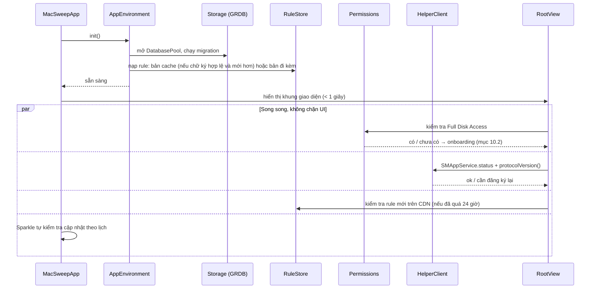

Nguyên tắc: chỉ những việc bắt buộc (database, rule đi kèm) chạy trước khi hiện UI; mọi thứ cần mạng hoặc XPC chạy sau và cập nhật UI khi xong.

### 23.2 Smart Scan

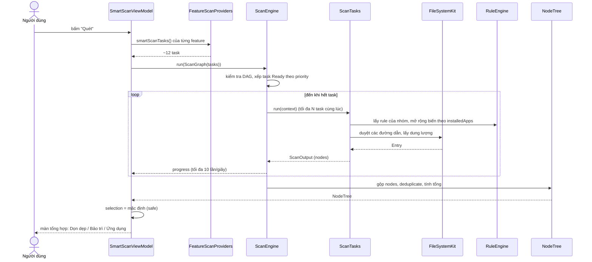

Dữ liệu đi qua từng bước:

| Bước | Đầu vào | Đầu ra | Nằm ở đâu |
|---|---|---|---|
| Gom task | Danh sách feature | `[ScanTask]` | Bộ nhớ |
| Chạy task | Rule + hệ thống tệp | `[Node]` mỗi task | Bộ nhớ |
| Gộp | Mọi `Node` | `NodeTree` | Bộ nhớ |
| Lưu phiên | `NodeTree` (tóm tắt) | 1 dòng `scan_session` | SQLite |
| Hiển thị | `NodeTree` + `SelectionState` | View | UI |

### 23.3 Dọn dẹp

Luồng chi tiết ở mục 7.1. Tóm tắt theo trạng thái của một mục:

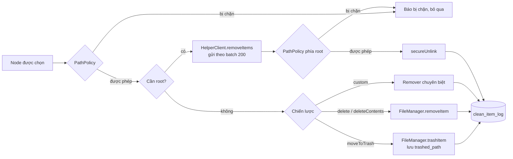

### 23.4 Một lệnh root đi qua hệ thống

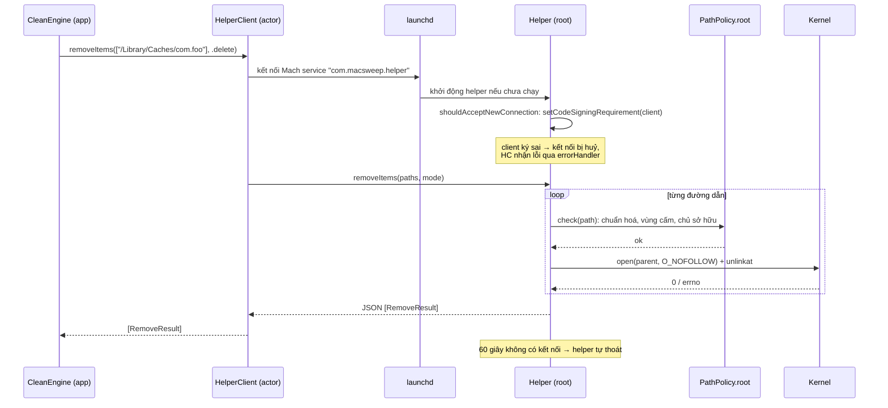

### 23.5 Gỡ app

```mermaid
sequenceDiagram
    actor U as Người dùng
    participant VM as UninstallerViewModel
    participant AS as AppScanner
    participant LF as LeftoverFinder
    participant WS as NSWorkspace
    participant CE as CleanEngine

    U->>VM: chọn "Foo.app", bấm Gỡ
    VM->>AS: thông tin app (bundleID, teamID, pkg receipts)
    VM->>LF: tìm file sót (bundleID → teamID → tên → LaunchAgent → pkgutil)
    LF-->>VM: danh sách kèm mức tin cậy
    VM-->>U: danh sách: chọn sẵn mức Chắc chắn/Cao
    U->>VM: xác nhận
    VM->>WS: app đang chạy? → NSRunningApplication.terminate(), chờ 10 giây
    alt vẫn chưa tắt
        VM-->>U: hỏi có buộc tắt (forceTerminate) không
    end
    VM->>CE: plan: .app → Thùng rác; file sót → delete/trash; LaunchAgent → bootout + xoá
    CE-->>VM: CleanReport
    VM->>VM: xoá app khỏi app_usage_cache
    VM-->>U: "Đã gỡ Foo, giải phóng 1,2 GB"
```

### 23.6 Space Lens

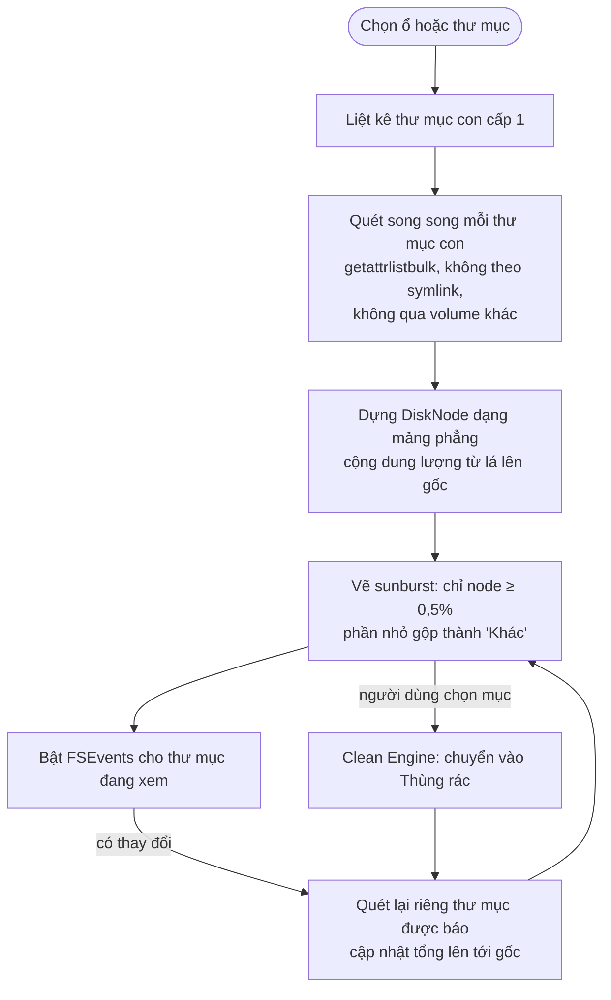

### 23.7 Menu bar: giám sát và cảnh báo

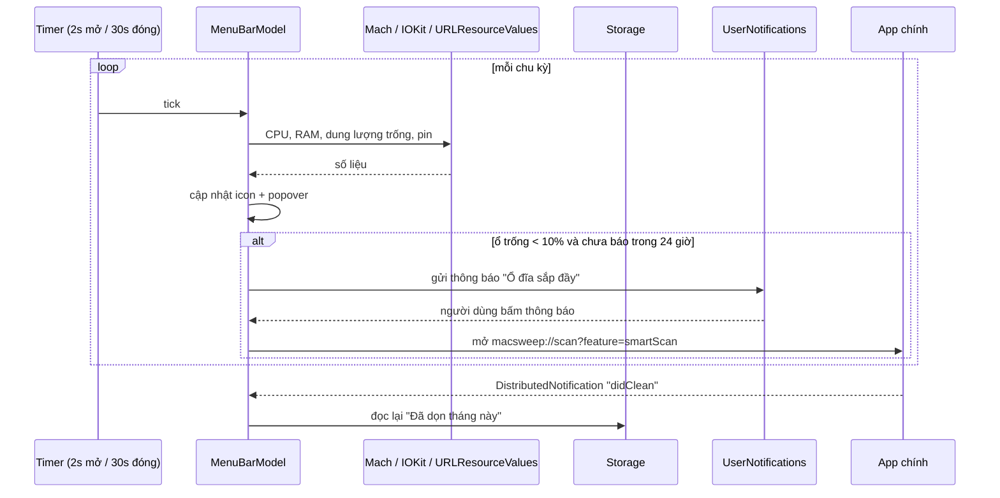

### 23.8 Vòng đời của một rule

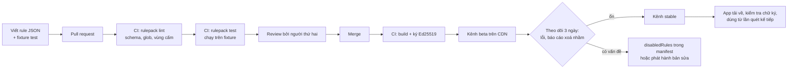

### 23.9 Tổng hợp: dữ liệu nằm ở đâu, sống bao lâu

| Dữ liệu | Tạo ở | Lưu ở | Thời gian sống |
|---|---|---|---|
| `NodeTree` | Scan Engine | Bộ nhớ app chính | Đến khi quét lại hoặc đóng màn hình |
| `SelectionState` | UI | Bộ nhớ | Như trên |
| `CleanPlan` | Clean Engine | Bộ nhớ, bản tóm tắt trong `clean_operation` | Đến khi dọn xong |
| Lịch sử dọn | Clean Engine | `clean_item_log` | 90 ngày |
| Danh sách bỏ qua | Người dùng | `ignore_entry` | Vĩnh viễn |
| Thông tin app | App Scanner | `app_usage_cache` | Làm mới khi app thay đổi |
| Rule | CI | Bundle trong app + cache Application Support | Đến khi có bản mới hơn |
| Số liệu menu bar | MenuBarModel | Bộ nhớ app menu bar | Không lưu |
